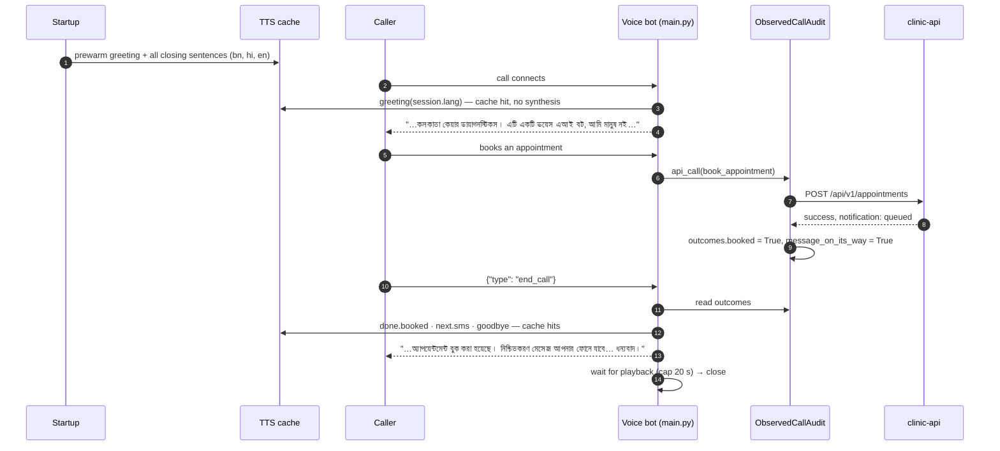
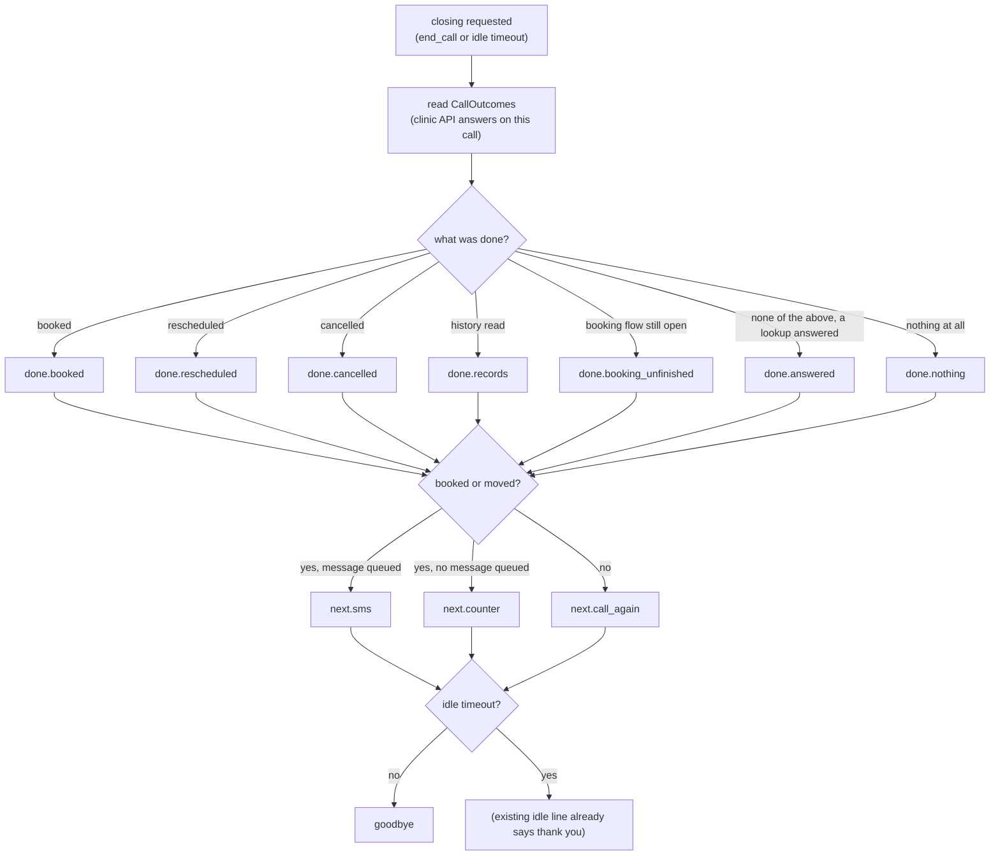

# Who Have I Reached, and Is It Automated? — Pre-warmed Greeting and Approved Closing

**Author:** Chakravardhan (team project — every new or changed block is marked `Author: Chakravardhan`)
**Story:** *As a caller, I want to know immediately who I have reached and that this is automated, so that I can decide how to use it.*
**Acceptance criteria:** The greeting names the hospital and discloses the automated system in the caller language, and a closing restates what was done and what happens next. Both are pre-warmed so neither costs synthesis latency. The wording is reviewed by the clinical and legal leads.
**Scope delivered (as asked):** the **pre-warmed greeting** and the **pre-warmed / approval-tracked closing**, on the voice bot (`main.py` → `main_pcm.py`).
**Branch:** `dev_chakravardhan`. **Status:** implemented and tested **locally only — not committed, not pushed.** No GPU needed for this work; real TTS timing can be measured on a GPU pod later.

---

## 0. What the story means

| Part | In plain words | What it forces in the code |
|---|---|---|
| "know immediately who I have reached" | The first words name the hospital. | The greeting contains the hospital name. |
| "and that this is automated" | The caller is told it is a machine, not a person. | The greeting says "voice AI bot, not a person" — explicitly. |
| "so that I can decide how to use it" | Knowing it is a machine, the caller can speak simply, use the keypad, or go to the counter. | The greeting also says what the bot can help with. |
| "in the caller language" | Bengali, Hindi or English. | Greeting and closing exist in all three and are spoken in the call's language. |
| "a closing restates what was done and what happens next" | Before the call ends: "your appointment was booked; a message will come to your phone; thank you". | Closing sentences chosen from what **the clinic API actually confirmed** on this call. |
| "Both are pre-warmed so neither costs synthesis latency" | No waiting for the voice to be generated. | Every greeting and closing sentence synthesized into the TTS cache **at startup**, for every language. |
| "wording is reviewed by the clinical and legal leads" | Doctors' side and legal side approve the exact words. | A review record tied to a **hash of the exact wording**; any change voids the approval; health shows the status. |

---

## 1. Summary — Old vs New

| | Old | New |
|---|---|---|
| Greeting text | "নমস্কার, কলকাতা কেয়ার ডায়াগনস্টিকসে স্বাগতম। কীভাবে সাহায্য করতে পারি?" | "নমস্কার, কলকাতা কেয়ার ডায়াগনস্টিকস। এটি একটি ভয়েস এআই বট, আমি মানুষ নই। টেস্টের দাম, ডাক্তারের সময় আর অ্যাপয়েন্টমেন্টে সাহায্য করতে পারি। বলুন, কী জানতে চান?" |
| Says it is automated | ❌ no | ✅ yes ("ভয়েস এআই বট … আমি মানুষ নই") |
| Says what it can do | ❌ | ✅ test prices, doctor timings, appointments |
| Languages | Bengali only (hard-coded) | Bengali / Hindi / English, in the call's language |
| Greeting pre-warmed | Bengali only (old text in `PREWARM_LINES`) | New text, **every enabled language** |
| Closing | ❌ none (only the idle-timeout line) | ✅ what was done + what happens next + goodbye |
| Closing source of truth | — | the clinic API's own responses on this call |
| SMS promise in closing | — | only if the booking's message is really `queued` |
| Closing pre-warmed | — | every closing sentence, every enabled language |
| Caller-requested end with closing | — | control message `{"type": "end_call"}` |
| Idle timeout | "লাইনে কোনো সাড়া পাচ্ছি না, কল শেষ করছি। ধন্যবাদ।" | closing (done + next) **then** the same line |
| Clinical/legal review | — | `REVIEW` record + wording hash; `/api/health` → `call_script.review` |
| `/api/health` | — | `call_script: {prewarmed, review}` |

**Not changed:** `agent/tts.py`, `agent/call_audit.py`, `agent/tools_client.py`, `agent/i18n.py`, `agent/reply_templates.py`, clinic-api, the browser clients (`static/`), the HTTP/WebSocket contract, all existing tests.

---

## 2. Architecture

### 2.1 The pieces

```text
 ┌──────────────────────────── agent/call_script.py (NEW) ────────────────────────────┐
 │  GREETING[bn|hi|en]         names hospital + "voice AI bot, not a person" + does │
 │  CLOSING[key][bn|hi|en]     done.* / next.* / goodbye  (fixed sentences)             │
 │  CallOutcomes               what the clinic API confirmed on this call               │
 │  closing_keys()             which sentences, in which order                          │
 │  ObservedCallAudit          CallAudit that also records API answers → outcomes       │
 │  prewarm(tts)               synthesize every line, every enabled language            │
 │  REVIEW + review_status()   clinical/legal sign-off tied to a wording hash           │
 │  health()                   prewarmed languages + review status                      │
 └──────────────────────────────────────────┬───────────────────────────────────────────┘
                                            │ used by
 ┌──────────────────────────────────────────▼───────────────────────────────────────────┐
 │  main.py / main_pcm.py                                                                │
 │   _startup          → _tts.prewarm()  +  call_script.prewarm(_tts)            (NEW)   │
 │   CallSession       → audit = call_script.ObservedCallAudit(...)              (NEW)   │
 │   ws_audio          → _speak(call_script.greeting(session.lang))              (NEW)   │
 │   _handle_control   → "end_call" → _end_call_with_closing()                   (NEW)   │
 │   idle timeout      → _speak_closing(include_goodbye=False) + idle line       (NEW)   │
 │   /api/health       → "call_script": call_script.health()                     (NEW)   │
 └──────────────────────────────────────────┬───────────────────────────────────────────┘
                                            │ unchanged
            agent/tts.py (cache) · agent/call_audit.py · agent/tools_client.py · clinic-api
```

### 2.2 A call from greeting to closing



### 2.3 How the closing is chosen



### 2.4 Why the closing is fixed sentences, not one composed sentence

| Option | Cache | Latency | Chosen? |
|---|---|---|---|
| One sentence per call ("Your appointment with Dr Sen on 20 Sept at 18:15, reference KCD-…") | miss every time | full synthesis per call | ❌ violates "no synthesis latency" |
| Sequence of fixed sentences, each pre-warmed | hit every time | none | ✅ |

The date, time and reference number were already spoken in the booking confirmation itself; the closing restates **that** it was booked and **what happens next**.

### 2.5 Pre-warm coverage

| Enabled languages | Lines warmed per language | Total |
|---|---|---|
| `bn` only (today's pod) | 1 greeting + 11 closing sentences = 12 | 12 |
| `bn, hi, en` | 12 | 36 |

Tested: every closing any combination of outcomes can produce is in the warmed set (`test_every_line_a_call_can_speak_is_prewarmed_in_every_language`).

---

## 3. The wording — as submitted for clinical and legal review

### 3.1 Greeting

| Lang | Text |
|---|---|
| bn | নমস্কার, কলকাতা কেয়ার ডায়াগনস্টিকস। এটি একটি ভয়েস এআই বট, আমি মানুষ নই। টেস্টের দাম, ডাক্তারের সময় আর অ্যাপয়েন্টমেন্টে সাহায্য করতে পারি। বলুন, কী জানতে চান? |
| hi | नमस्ते, कोलकाता केयर डायग्नोस्टिक्स। यह एक वॉइस एआई बॉट है, मैं इंसान नहीं हूँ। टेस्ट की कीमत, डॉक्टर का समय और अपॉइंटमेंट में मदद कर सकता हूँ। बताइए, क्या जानना है? |
| en | Hello, this is Kolkata Care Diagnostics. This is a voice AI bot, not a person. I can help with test prices, doctor timings and appointments. How can I help you? |

### 3.2 Closing sentences

| Key | When | bn | hi | en |
|---|---|---|---|---|
| `done.booked` | booking confirmed by API | আজ এই কলে আপনার অ্যাপয়েন্টমেন্ট বুক করা হয়েছে। | आज इस कॉल में आपका अपॉइंटमेंट बुक किया गया है। | On this call, your appointment was booked. |
| `done.rescheduled` | reschedule confirmed | আজ এই কলে আপনার অ্যাপয়েন্টমেন্টের সময় বদলানো হয়েছে। | आज इस कॉल में आपके अपॉइंटमेंट का समय बदला गया है। | On this call, your appointment was moved. |
| `done.cancelled` | cancellation confirmed | আজ এই কলে আপনার অ্যাপয়েন্টমেন্ট বাতিল করা হয়েছে। | आज इस कॉल में आपका अपॉइंटमेंट रद्द किया गया है। | On this call, your appointment was cancelled. |
| `done.records` | history read after verification | আজ এই কলে আপনার রেকর্ডের তথ্য জানানো হয়েছে। | आज इस कॉल में आपके रिकॉर्ड की जानकारी दी गई है। | On this call, you were told about your records. |
| `done.answered` | only lookups (price / doctor / department) | আজ এই কলে আপনার প্রশ্নের উত্তর দেওয়া হয়েছে, কোনো বুকিং করা হয়নি। | आज इस कॉल में आपके सवाल का जवाब दिया गया, कोई बुकिंग नहीं हुई। | On this call, your questions were answered; nothing was booked. |
| `done.booking_unfinished` | booking flow left open | আপনার বুকিং শেষ হয়নি, তাই কোনো অ্যাপয়েন্টমেন্ট করা হয়নি। | आपकी बुकिंग पूरी नहीं हुई, इसलिए कोई अपॉइंटमेंट नहीं बना। | Your booking was not finished, so no appointment was made. |
| `done.nothing` | nothing done | আজ এই কলে কোনো বুকিং বা পরিবর্তন করা হয়নি। | आज इस कॉल में कोई बुकिंग या बदलाव नहीं हुआ। | Nothing was booked or changed on this call. |
| `next.sms` | booked/moved **and** message `queued` | নিশ্চিতকরণ মেসেজ আপনার ফোনে যাবে, কাউন্টারে সেটি দেখাবেন। | पुष्टि का मैसेज आपके फ़ोन पर आएगा, काउंटर पर उसे दिखाइए। | A confirmation message will come to your phone; please show it at the counter. |
| `next.counter` | booked/moved, **no** message queued | আসার দিন কাউন্টারে আপনার নাম আর ফোন নম্বর বললেই হবে। | आने के दिन काउंटर पर अपना नाम और फ़ोन नंबर बता दीजिए। | On the day, give your name and phone number at the counter. |
| `next.call_again` | anything else | আর কিছু লাগলে আবার ফোন করুন, অথবা কাউন্টারে আসুন। | और कुछ चाहिए तो फिर से फ़ोन करें, या काउंटर पर आइए। | If you need anything else, call again or come to the counter. |
| `goodbye` | always (not on idle timeout) | কলকাতা কেয়ার ডায়াগনস্টিকসে ফোন করার জন্য ধন্যবাদ। | कोलकाता केयर डायग्नोस्टिक्स को फ़ोन करने के लिए धन्यवाद। | Thank you for calling Kolkata Care Diagnostics. |

### 3.3 Sign-off procedure

1. Clinical lead and legal lead review §3.1 and §3.2 (Hindi/English also by native speakers).
2. After approval, compute the fingerprint: `python -c "from agent import call_script; print(call_script.wording_fingerprint())"`.
3. Update `REVIEW` in `agent/call_script.py`: `wording_sha256`, `clinical_lead`, `legal_lead`, `approved_on`, `version`.
4. `/api/health` → `call_script.review.approved` becomes `true`.
5. **Any later wording change** → `wording_matches_approval: false`, `approved: false` until re-approved.

---

## 4. Files

| File | Change | Lines |
|---|---|---|
| `agent/call_script.py` | **NEW** — wording, outcomes, closing selection, observed audit, pre-warm, review, health | 376 |
| `main.py` | **ADDITIVE** — import, pre-warm, observed audit, greeting, idle closing, `end_call`, closing helpers, health | ~+60 |
| `main_pcm.py` | regenerated (`python tools/make_pcm_variant.py`) | — |
| `tests/test_call_script.py` | **NEW** — 32 tests, 43 cases | 374 |
| `IMPLEMENTATION_CALL_GREETING_CLOSING_OLD_VS_NEW.md` | **NEW** — this file | |

---

## 5. Variables

### 5.1 `agent/call_script.py`

| Name | Type / value | Purpose |
|---|---|---|
| `HOSPITAL_NAME` | dict bn/hi/en | the name the greeting and goodbye must contain (tested) |
| `GREETING` | dict bn/hi/en | disclosed greeting |
| `DONE_*`, `NEXT_*`, `GOODBYE` | string keys | closing sentence identifiers |
| `CLOSING` | dict key → dict bn/hi/en | closing sentences |
| `ScriptReview` | version, wording_sha256, clinical_lead, legal_lead, approved_on | the sign-off record |
| `REVIEW` | draft, unsigned | current sign-off (pending) |
| `_LOOKUPS` | get_test_rate, get_doctor_availability, get_doctors_by_department | API actions that count as "answered" |
| `_BOOKING_STATES` | doctor_choice … phone | pending states that mean "booking unfinished" |
| `CallOutcomes` | booked, rescheduled, cancelled, records_shared, answered, message_on_its_way | what this call did |
| `END_CALLER_ENDED` | `"caller_ended"` | termination reason for `end_call` |
| `_WARM` | dict lang → bool | which languages pre-warmed completely |

### 5.2 `main.py`

| Name | Value | Purpose |
|---|---|---|
| `CLOSING_PLAYBACK_CAP_S` | `20.0` | max wait for the closing to finish playing before the socket closes |
| `CallSession.closing_spoken` | bool | closing spoken at most once per call |
| control message | `{"type": "end_call"}` | caller asks to end the call and hear the closing |

### 5.3 `/api/health` (voice agent)

```json
"call_script": {
  "prewarmed": {"bn": true},
  "review": {
    "version": "2026-09-15-draft-1",
    "approved": false,
    "clinical_lead_signed": false,
    "legal_lead_signed": false,
    "approved_on": null,
    "wording_matches_approval": false,
    "wording_sha256": "…"
  }
}
```

---

## 6. `main.py` — Old vs New

### 6.1 Import

```python
# OLD
from agent import code_mix
```

```python
# NEW
from agent import code_mix
# GREETING AND CLOSING -- Author: Chakravardhan. See agent/call_script.py.
from agent import call_script
```

| Line | Explanation |
|---|---|
| `from agent import call_script` | The only new dependency; `call_script` imports `httpx`, `call_audit`, `language` — all already used by `main.py`. |

### 6.2 Startup — pre-warm

```python
# OLD
    logger.info("prewarming TTS...")
    await _tts.prewarm()
```

```python
# NEW
    logger.info("prewarming TTS...")
    await _tts.prewarm()
    # GREETING AND CLOSING -- Author: Chakravardhan. The disclosed greeting and
    # every closing sentence, in every language this pod serves, so neither
    # costs synthesis latency on a live call.
    await call_script.prewarm(_tts)
```

| Line | Explanation |
|---|---|
| `_tts.prewarm()` unchanged | Existing fixed lines (busy line, apologies) still warmed. |
| `call_script.prewarm(_tts)` | Synthesizes greeting + 11 closing sentences for each language in `language.enabled()` into the **same** TTS cache `_speak` reads — so the live greeting and closing are cache hits. |

### 6.3 CallSession — observed audit

```python
# OLD
        self.audit = call_audit.CallAudit(_audit_store, self.call_id,
                                          transport=AUDIT_TRANSPORT, language=self.lang)
```

```python
# NEW
        # GREETING AND CLOSING -- Author: Chakravardhan. The ordinary CallAudit,
        # also remembering what the clinic API answered, for the closing.
        self.audit = call_script.ObservedCallAudit(_audit_store, self.call_id,
                                                   transport=AUDIT_TRANSPORT, language=self.lang)
        self.closing_spoken = False
```

| Line | Explanation |
|---|---|
| `ObservedCallAudit(...)` | A subclass of `CallAudit`: identical recording; additionally `outcomes` is filled from every clinic-API answer (every call through `tools_client` already goes through `CallAudit.api_call`). No change to `call_audit.py` or `tools_client.py`. |
| `self.closing_spoken = False` | Guards against speaking the closing twice (e.g. `end_call` and idle timeout racing). |

### 6.4 ws_audio — greeting

```python
# OLD
        await _speak(session, "নমস্কার, কলকাতা কেয়ার ডায়াগনস্টিকসে স্বাগতম। কীভাবে সাহায্য করতে পারি?")
```

```python
# NEW
        # GREETING -- Author: Chakravardhan. Names the hospital and says this is
        # an automated system, in the call's language; pre-warmed at startup.
        await _speak(session, call_script.greeting(session.lang))
```

| Line | Explanation |
|---|---|
| `call_script.greeting(session.lang)` | The disclosed greeting in the call's language at connect time (the pod default — nothing else is known before the caller speaks). Same `_speak` path: text frame, TTS (cache hit), audio, audit `AGENT_RESPONSE`. Still starts with "নমস্কার" (an existing audit test relies on that). |

### 6.5 Idle timeout — closing

```python
# OLD
            session.end_reason = call_audit.END_IDLE_TIMEOUT
            await _speak(session, "লাইনে কোনো সাড়া পাচ্ছি না, কল শেষ করছি। ধন্যবাদ।")
            with contextlib.suppress(Exception):
                await session.ws.close()
            return
```

```python
# NEW
            session.end_reason = call_audit.END_IDLE_TIMEOUT
            # CLOSING -- Author: Chakravardhan. What was done and what happens
            # next, then the line that already says the call is ending (and
            # already thanks the caller, so no second goodbye).
            await _speak_closing(session, include_goodbye=False)
            await _speak(session, "লাইনে কোনো সাড়া পাচ্ছি না, কল শেষ করছি। ধন্যবাদ।")
            with contextlib.suppress(Exception):
                await session.ws.close()
            return
```

| Line | Explanation |
|---|---|
| `_speak_closing(..., include_goodbye=False)` | Restates what was done + what happens next. No `goodbye` sentence, because the idle line already thanks the caller. |
| idle line unchanged, **last** | Keeps the existing behaviour and the existing test (`test_idle_timeout_is_recorded_as_such` expects it last). |
| no playback wait added | The idle path closes exactly as before. |

### 6.6 Control channel — `end_call`

```python
# NEW (in _handle_control, after "dtmf")
    elif msg.get("type") == "end_call":
        # CLOSING -- Author: Chakravardhan. The caller asks to end the call and
        # hears the closing first. A task, like dtmf, so the receive path keeps
        # reading -- including the playback_done that ends the wait below.
        asyncio.create_task(_end_call_with_closing(session))
```

| Line | Explanation |
|---|---|
| new message type | Existing message types (`playback_done`, `audio_mode`, `dtmf`) unchanged. Clients that never send `end_call` behave exactly as before. |
| `asyncio.create_task` | The receive loop keeps running, so `playback_done` can arrive and end the playback wait. |

### 6.7 NEW — closing helpers

```python
CLOSING_PLAYBACK_CAP_S = 20.0


async def _speak_closing(session: CallSession, *, include_goodbye: bool = True) -> None:
    if getattr(session, "closing_spoken", False):
        return
    session.closing_spoken = True
    outcomes = getattr(session.audit, "outcomes", None) or call_script.CallOutcomes()
    for line in call_script.closing(outcomes, session.pending, session.lang,
                                    include_goodbye=include_goodbye):
        await _speak(session, line)


async def _wait_for_playback(session: CallSession, cap_s: float = CLOSING_PLAYBACK_CAP_S) -> None:
    give_up = time.time() + cap_s
    while session.agent_speaking:
        played_by = session.speak_deadline - PLAYBACK_GUARD_S
        if time.time() >= min(give_up, played_by):
            return
        await asyncio.sleep(0.1)


async def _end_call_with_closing(session: CallSession) -> None:
    session.end_reason = call_script.END_CALLER_ENDED
    await _speak_closing(session)
    await _wait_for_playback(session)
    with contextlib.suppress(Exception):
        await session.ws.close()
```

| Line | Explanation |
|---|---|
| `CLOSING_PLAYBACK_CAP_S = 20.0` | Upper bound on waiting; a client that never reports playback cannot hold the call open. |
| `if getattr(session, "closing_spoken", False): return` | Spoken once per call. |
| `outcomes = getattr(...) or CallOutcomes()` | A test double / message session without an observed audit gets an empty outcome set → "nothing done". |
| `for line in call_script.closing(...)` | Each sentence spoken separately → each a cache hit. |
| `session.pending` | An open booking flow → "booking not finished". |
| `session.lang` | The call's **current** language (follows a language switch). |
| `_wait_for_playback` | Returns when the client reports playback done (`agent_speaking` False), the clips' own duration has passed (`speak_deadline − PLAYBACK_GUARD_S`), or the cap — whichever first. |
| `session.end_reason = END_CALLER_ENDED` | The audit records `termination_reason: caller_ended` (a normal end). |
| `ws.close()` | Ends the call after the caller heard the closing. |

### 6.8 `/api/health`

```python
# NEW key
        "call_script": call_script.health(),
```

| Line | Explanation |
|---|---|
| `call_script.health()` | `prewarmed` per language + `review` status. Response content only — the HTTP contract (paths, parameters) is unchanged, `api-contract` passes. |

---

## 7. `agent/call_script.py` — NEW, line by line

| Lines | Code | Explanation |
|---|---|---|
| 1–64 | module docstring | What changed from the old greeting; why the closing is fixed sentences; caller language; clinical/legal review mechanism. |
| 66–78 | imports, logger | `httpx` (to name the TTS errors caught in pre-warm), `call_audit` (base class), `language`. |
| 80 | `HOSPITAL_NAME` | Hospital name per language — tests assert the greeting and goodbye contain it. |
| 89 | `GREETING` | Three greetings: hospital, "automated system, not a person", what it helps with, invitation to speak. |
| 108–120 | `DONE_*`, `NEXT_*`, `GOODBYE` | Stable keys for closing sentences. |
| 122 | `CLOSING` | 11 sentences × 3 languages (§3.2). |
| 185 | `ScriptReview` | Frozen dataclass: `version`, `wording_sha256`, `clinical_lead`, `legal_lead`, `approved_on`. |
| 196 | `REVIEW` | Draft, unsigned — honestly pending until the leads sign. |
| 205 | `wording_fingerprint()` | SHA-256 of `{"greeting": GREETING, "closing": CLOSING}` as sorted JSON — deterministic. |
| 211 | `review_status()` | `approved` only if both leads signed, a date is set, **and** the stored hash equals today's wording hash. |
| 229–230 | `_LOOKUPS`, `_BOOKING_STATES` | Which API actions mean "answered"; which pending states mean "booking unfinished" (verification states excluded — tested). |
| 234 | `CallOutcomes` | Six booleans. |
| `CallOutcomes.note()` | lookup with `found` → answered; `read_history` found → records; book/reschedule/cancel **with `success`** → that flag; `notification.status == "queued"` → message on its way; anything else ignored; never raises. |
| 265 | `closing_keys()` | done sentences in fixed order (booked, rescheduled, cancelled, records, unfinished) or answered/nothing; then next (sms / counter / call again); then goodbye. |
| 295 | `greeting(lang)` | `GREETING[language.resolve(lang)]` — an unservable language falls back to the default. |
| 299 | `closing(...)` | Keys → sentences in the resolved language; `include_goodbye=False` drops the goodbye. |
| 313 | `END_CALLER_ENDED` | `"caller_ended"`. |
| 316 | `ObservedCallAudit` | `__init__` adds `outcomes`; `api_call` wraps the call factory so the raw result is noted, then delegates to `CallAudit.api_call` — recording, classification, failures and re-raising are the base class's own. |
| 337 | `lines_for(lang)` | Greeting + every closing sentence in one language — what pre-warm synthesizes. |
| 343 | `_WARM` | Per-language pre-warm result. |
| 346 | `prewarm(tts)` | Clears `_WARM` (bug found by tests: stale languages were reported), then for each enabled language synthesizes every line; on `httpx.HTTPError`/`OSError`/`RuntimeError`/`ValueError` logs the language (no text), marks it not warm and moves on; logs a warning if the wording is not approved. Never stops startup. |
| 375 | `health()` | `{"prewarmed": …, "review": review_status()}`. |

---

## 8. Tests — `tests/test_call_script.py` (32 tests, 43 cases)

| Group | Test | Proves |
|---|---|---|
| **Greeting** | `test_the_greeting_names_the_hospital_and_discloses_automation` ×3 | hospital name + disclosure words in bn/hi/en |
| | `test_the_greeting_is_spoken_in_the_call_language` ×3 | language selection |
| | `test_a_language_the_pod_cannot_serve_falls_back_to_the_default` | safe fallback |
| | `test_the_old_greeting_did_not_disclose_automation` | documents the gap closed |
| | `test_a_live_call_opens_with_the_disclosed_greeting` | real `ws_audio` speaks it first |
| **Closing** | `test_a_call_that_did_nothing_says_so_and_what_to_do_next` | nothing → call again → goodbye |
| | `test_a_call_that_only_answered_questions_says_nothing_was_booked` | answered |
| | `test_a_booking_with_a_queued_message_promises_the_message` | SMS promised only when queued |
| | `test_a_booking_with_no_message_on_its_way_never_promises_one` | counter instead |
| | `test_an_unfinished_booking_is_restated_as_not_made` | open booking flow |
| | `test_several_things_done_are_each_restated` | order |
| | `test_a_verification_in_progress_is_not_called_a_booking` | not misreported |
| | `test_the_idle_path_closing_has_no_second_goodbye` | idle variant |
| | `test_outcomes_come_from_the_clinic_apis_own_answers` ×6 | per API action |
| | `test_a_failed_booking_is_not_restated_as_made` | failures and junk ignored |
| | `test_only_a_queued_message_earns_the_promise` | skipped ≠ queued |
| | `test_the_calls_audit_remembers_what_the_api_answered_and_still_records_it` | observed audit; errors re-raised, counted, not noted |
| **Every line** | `test_every_closing_sentence_exists_in_every_language` | bn/hi/en complete |
| | `test_nothing_the_script_says_needs_a_smartphone` ×3 | no link/app/QR |
| | `test_the_goodbye_names_the_hospital_in_every_language` | name in goodbye |
| **Pre-warmed** | `test_every_line_a_call_can_speak_is_prewarmed_in_every_language` | every possible closing (all outcome combinations) is in the warmed set |
| | `test_a_bengali_only_pod_prewarms_bengali` | only enabled languages |
| | `test_a_failing_tts_does_not_stop_startup_and_is_reported` | failure isolated, reported |
| | `test_startup_prewarms_the_script` | wired into startup |
| **Review** | `test_unsigned_wording_is_not_approved` | pending by default |
| | `test_wording_signed_by_both_leads_is_approved` | both leads required |
| | `test_changing_one_word_voids_the_approval` | hash-bound approval |
| **The call** | `test_the_closing_restates_a_booking_from_the_api_and_is_spoken_once` | real `_speak_closing`, once |
| | `test_the_closing_follows_the_callers_language` | Hindi closing after switch |
| | `test_end_call_speaks_the_closing_then_closes_the_call` | closing, `caller_ended`, socket closed |
| | `test_the_end_call_control_message_is_understood` | control wired |
| | `test_waiting_for_playback_never_outlasts_its_cap` | no hang |

Existing tests that cover this code and still pass unchanged: `test_call_audit.py` (greeting starts with "নমস্কার"; idle timeout last line, final status), `test_gate_telephony.py`, `test_gate_handoff_fallback.py`, `test_speakerphone.py`, `test_channel_parity.py`.

---

## 9. Results (local)

| Check | Result |
|---|---|
| `python -m pytest tests/test_call_script.py` | **43 passed** |
| `python -m pytest tests` | **836 passed, 2 failed** — the 2 are the pre-existing golden-set entry `fp-abstain-unknown-doctor` |
| `bash scripts/gate.sh --full` | **PASS:** compile, lint, typecheck, dead-code, bandit, secrets, credentials, dependencies, **build (main_pcm in sync)**, **api-contract (unchanged)**, debug-code, unexpected-files, PHI in code, **PHI in logs**, test data, **gate-protection**, integration, safety-policy, phi-boundary, multilingual, handoff, 8 kHz, telephony |
| Still red, not caused by this story | `format` (same 42 pre-existing files; new files formatted), golden-set / escalation-abstention / unit-tests (golden entry) |
| Suppressions added | **0** |
| Bugs found by the new tests and fixed | pre-warm reported stale languages; an idle-path playback wait would have delayed existing idle behaviour (removed) |

---

## 10. How to run

```bash
python -m pytest tests/test_call_script.py -v
```

```bash
python tools/make_pcm_variant.py
```

```bash
python -c "from agent import call_script; print(call_script.wording_fingerprint())"
```

```bash
curl -s http://localhost:8100/api/health
```

A client asks for the closing before hanging up by sending, on the call's WebSocket:

```json
{"type": "end_call"}
```

---

## 11. Honest limits and next steps

| Limit | Why | Next step |
|---|---|---|
| **Wording not yet approved** by the clinical and legal leads. | Only they can approve; code records it. | Review §3, sign off, update `REVIEW` (§3.3). |
| **The browser clients don't send `end_call` yet** — pressing "end call" closes the socket, so the caller does not hear the closing on that path. | Clients (`static/index.html`, `static/pcm/index.html`) were left unchanged per scope. | In `endCall()`: send `{"type":"end_call"}`, wait for the server to close (or a timeout), then tear down. |
| A caller who simply hangs up cannot hear a closing. | The line is already gone. | Not solvable server-side; the booking reply already carries the details. |
| Greeting is in the pod's default language at connect time. | The caller's language is unknown before they speak. | Optional: a short trilingual "press/say for Hindi/English" once more languages are live. |
| The idle-timeout line itself is still Bengali-only (existing text). | Out of this story's scope. | Move it into `call_script` with hi/en and review. |
| Hindi/English audio needs those TTS voices and ASR checkpoints on the pod. | Today's pod is Bengali-only; pre-warm covers `language.enabled()`. | Install voices; pre-warm then covers them automatically. |
| Pre-warm time and cache-hit latency not measured on real TTS. | No GPU TTS on this machine. | On the GPU pod: check startup log "prewarm", `/api/stats` → `tts_cache.hit_rate`, and time-to-first-audio of the greeting. |
| The longer greeting takes a few more seconds to hear. | Disclosure + capabilities. | Clinical/legal/UX review may shorten it; any change re-runs the review hash. |
| The old greeting text is still in `agent/tts.py PREWARM_LINES`. | `tts.py` left unchanged. | Remove it in a later cleanup (costs one cached clip, harmless). |
