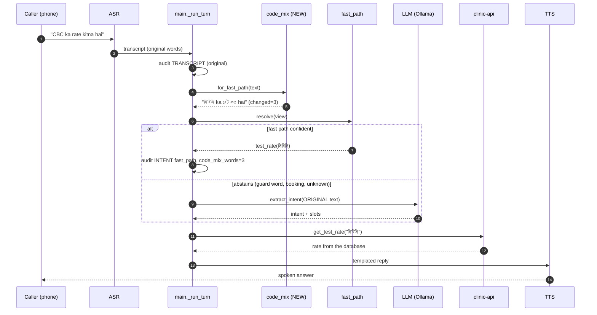
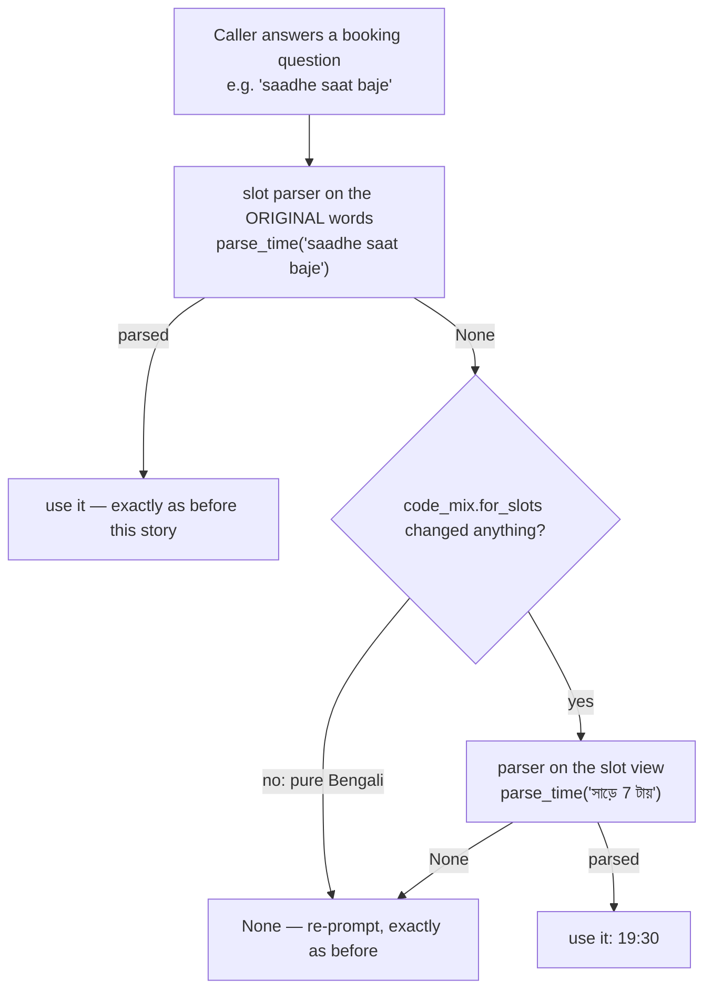
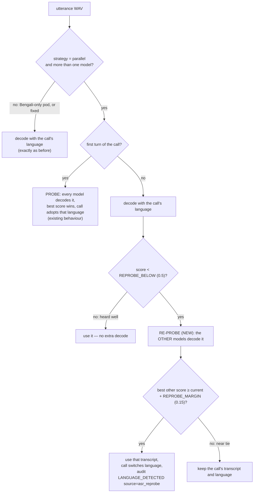

# Speaking in Whatever Mixture — Old vs New Code, Architecture, Line by Line

**Author:** Chakravardhan (team project — every new or changed block in the code is marked `Author: Chakravardhan`)
**Story:** *As a patient more comfortable speaking than typing, I want to send a voice note in whatever mixture I speak, so that literacy is not a barrier.*
**Where it lives:** the **voice bot** — you speak to the bot and it listens and answers (`main.py` / `main_pcm.py`: microphone → WebSocket → VAD → ASR → understanding → spoken reply). **Not** WhatsApp: the message channel is for typed messages and is untouched by this story.
**Two parts:** (A) **hear** all three languages on every turn — Bengali, Hindi, English — even when the caller switches mid-call; (B) **understand** the words of a sentence that mixes them.
**Branch:** `dev_chakravardhan`. **Old** = the working tree before this story (on top of commit `932dbb2`). **New** = the working tree now.
**Status:** implemented and tested **locally only — not committed, not pushed.**

---

## 0. What the story means on the voice bot

| Part of the story | In plain words | What it forces in the code |
|---|---|---|
| "more comfortable speaking than typing" | The caller talks to the voice bot. No typing and no reading needed. | Both **hearing** (ASR in the right language) and **understanding** (fast path, slot parsers, LLM) must work on the spoken path. |
| "in whatever mixture I speak" | One call — even one sentence — can hold Bengali, Hindi and English: a Bengali greeting then a Hindi question; "CBC ka rate kitna hai"; "nine eight three double zero…". | (A) a later turn in another language must be heard by **that** language's speech model; (B) every **local** parser must read words from all three languages. |
| "so that literacy is not a barrier" | The caller is never forced to switch to "proper" Bengali, spell something or type. | Mixed speech must be understood **as correctly** as pure Bengali, and never *less safely*. |

What it does **not** mean:

- **Changing what the caller said.** The transcript that is audited, cached and sent to the LLM is the caller's own words. Only what each *local parser* is shown changes.
- **Changing Bengali behaviour.** A pure-Bengali turn reaches every parser byte-for-byte as before (tested over the whole golden set).
- **Answering more at the cost of safety.** Understanding a mixture is only allowed if the **guard** words of every language ("and", "not", "Monday", "September") are understood too.

---

## 1. What was wrong — measured, before this story

Run against the seeded 34-test / 32-doctor catalogue with the real `agent/fast_path.py`:

| Caller said | Old behaviour | Why it is wrong |
|---|---|---|
| `CBC ka rate kitna hai` | not understood locally, went to the LLM | "rate", "kitna" and "CBC" are not in the fast path's Bengali vocabulary |
| `डॉक्टर सेन कल बैठेंगे` | not understood locally | Devanagari; cues and aliases are Bengali-script |
| `doctor Sen kab baithenge` | not understood locally | "kab" and "baithenge" are not cues |
| **`সিবিসির দাম কত aur ESR`** | **quoted ESR's price only** | "aur" (= and) is a guard word in Hindi, so the compound-question guard never fired. **Half a two-test question answered with confidence.** |
| **`ডাক্তার সেন monday বসবেন`** | **answered with today's schedule** | "monday" is not a Bengali weekday word, so the fast path thought no date was said and used today. **Wrong day.** |
| **`ডাক্তার সেন কাল বসবেন na?`** | **answered** | "na" (a negation) was not recognised as a guard. |
| **(A) hearing** — pod with bn + hi + en speech models, `VOICE_AGENT_LANG_STRATEGY=parallel`: caller greets in Bengali, then asks `सीबीसी का रेट क्या है` | the Hindi question is decoded by the **Bengali** model (`সিবি কা রেট`) — the language was probed on turn one only and locked for the whole call | a caller who switches language mid-call is never heard in the language they switched to |
| booking flow, asked the time: `saadhe saat baje` | not parsed, asked again | `slot_parse.parse_time` reads Bengali, not romanised Hindi |
| booking flow, asked the number: `nine eight three double zero one two three four five` | not parsed, asked again (up to 3 times, then the booking is lost) | `parse_phone` needs digits; number *words* and "double" were not read |
| booking flow: `nahi ji` | not recognised as "no", so the booking was not abandoned | `is_negative` is an exact match on a fixed set |

The three rows in **bold** are the reason this story is also a **patient-safety** fix, not only a convenience.

---

## 2. Summary — Old vs New

| | Old | New |
|---|---|---|
| **Hearing a later turn in another language** (bn+hi+en pod, `parallel`) | probed once on turn one; every later turn decoded by that one model | a badly-heard turn is **re-heard by the other language models**; a clearly better transcript wins and the call switches language |
| Well-heard turns | one decode | one decode — **no extra cost** |
| Mixed-language question on the fast path | Bengali cue words only | Bengali, Hindi (Devanagari + romanised), English, plus the Bengali-script spellings a Bengali ASR writes for them |
| Guard words (and / or / not / all / other / weekday / month) | Bengali only | **all three languages** → the fast path abstains correctly |
| Acronyms (CBC, ESR, TSH, HbA1c, LFT) | matched only if the Latin name equalled the catalogue name | spelled the way the catalogue holds them: `cbc → সিবিসি`, `hba1c → এইচবিএ১সি` |
| Devanagari entity words (`सेन`, `मुखर्जी`) | never matched Bengali aliases | written in Bengali script before matching (`সেন`) |
| Booking dates | Bengali / Devanagari / English day words | also `kal`, `parso`, `টুমরো`, `সানডে`, `somvar` … |
| Booking times | Bengali forms, digits, "10 am" | also `saat baje`, `saadhe saat`, `subah das baje`, `evening 6 o'clock`, `সেভেন পিএম`, `শাম সাত বজে` |
| Phone numbers | digits in any script | also number **words** in English / Hindi, and "double" / "triple" |
| Yes / No | fixed exact sets | also `haan ji`, `theek hai`, `ইয়েস`, `nahi ji`, `নেহি`, `নো থ্যাংকস` |
| Choosing a doctor from a list | English surname or Bengali alias | also a name said in Devanagari |
| What the LLM receives | caller's words | **unchanged** — caller's words |
| What the audit records | transcript; fast-path intent | unchanged, plus `code_mix_words: n` on a fast-path intent that needed it |
| Patient name / verification answer | as said | **unchanged — never rewritten** |
| Switches | — | `VOICE_AGENT_CODE_MIX=0` turns understanding off; re-probe only runs under `VOICE_AGENT_LANG_STRATEGY=parallel` with more than one speech model, tunable by `VOICE_AGENT_REPROBE_BELOW` / `VOICE_AGENT_REPROBE_MARGIN` |

**Not changed:** `agent/fast_path.py`, `agent/slot_parse.py`, `agent/llm.py`, `agent/asr.py`, `agent/language.py`, the golden set, clinic-api, the voice agent's HTTP contract, the WhatsApp channel, and every existing test.

---

## 3. Architecture — the working process

### 3.1 Where the new module sits in one call turn

```text
   CALLER speaking to the voice bot: "CBC ka rate kitna hai"
        │  audio (browser mic PCM, or 8 kHz telephony)
        ▼
   main._turn_poll_loop → VAD → utterance WAV
        ▼
   audio_quality → ASR in the call's language (IndicConformer)
        │     badly heard + other languages on the pod?  → re-probe bn / hi / en   ◄ NEW (A)
        │  transcript = "CBC ka rate kitna hai"
        ▼
   main._run_turn
        │  audit.transcript(text)                           ← the ORIGINAL words
        │  language switch check                            (unchanged)
        │
        ├── booking / verification in progress? → _continue_pending
        │        │
        │        ├─ history_verify ─────────────────────────► verify_caller(ORIGINAL)   never rewritten
        │        ├─ record_phone   code_mix.first_parse(parse_phone / is_negative)     ◄ NEW
        │        ├─ escape hatch   code_mix.first_parse(is_negative)                   ◄ NEW
        │        ├─ doctor_choice  code_mix.first_match(_match_candidate_doctor)       ◄ NEW
        │        ├─ department_date / date   code_mix.first_parse(parse_date)          ◄ NEW
        │        ├─ time_slot      code_mix.first_parse(parse_time)                    ◄ NEW
        │        ├─ phone          code_mix.first_parse(parse_phone)                   ◄ NEW
        │        └─ patient_name   _clean_patient_name(ORIGINAL)   never rewritten
        │
        └── otherwise → _resolve_intent
                 │
                 ├─ TIER 1  fast path  reads  code_mix.for_fast_path(text).text        ◄ NEW
                 │          "সিবিসি ka রেট কত hai"  → test_rate(সিবিসি)  → no LLM call
                 │
                 ├─ TIER 2  intent cache   reads ORIGINAL text                          (unchanged)
                 └─ TIER 3  LLM            reads ORIGINAL text                          (unchanged)
                          │
                          ▼
             clinic-api (live) → reply_templates → TTS → caller hears the answer
```

### 3.2 The same thing as a sequence diagram



### 3.3 Booking flow — the "second chance" rule



Anything that parsed before the story still parses the same way, because the caller's own words are always tried first. The mixed view can only turn a **None** into a value.

### 3.4 The three views, side by side

| Caller said | `for_fast_path` (fast path) | `for_slots` (dates, times, numbers, yes/no) | `for_matching` (doctor list) |
|---|---|---|---|
| `CBC ka rate kitna hai` | `সিবিসি ka রেট কত hai` | `CBC ka রেট কত hai` | unchanged |
| `डॉक्टर सेन कल बैठेंगे` | `ডাক্তার সেন কাল বসবেন` | `ডাক্তার सेन কাল বসবেন` | `ডোক্টর সেন কল বৈঠেংগে` |
| `সিবিসির দাম কত aur ESR` | `সিবিসির দাম কত আর ইএসআর` → **abstain** | — | — |
| `Dr Sen 15 september ko` | `ডাক্তার Sen 15 তারিখ ko` → **abstain** | `… september …` left as is | — |
| `saadhe saat baje` | — | `সাড়ে 7 টায়` → `19:30` | — |
| `শাম সাত বজে` | — | `সন্ধ্যা সাতটা` → `19:00` | — |
| `nine eight three double zero one two three four five` | digits → abstain | `9 8 3 0 0 1 2 3 4 5` → `9830012345` | — |
| `haan ji` | — | `হ্যাঁ` → affirmative | — |
| `ডাক্তার সেন আজ বসবেন` (pure Bengali) | **unchanged** | **unchanged** | **unchanged** |

Why the views differ:
- **Months** become a date marker for the fast path, so it abstains; the slot parser leaves them alone. Turning "15 september" into "15 তারিখ" would book the 15th of the **current** month.
- **Acronym spelling** and **clinical English** matter only for matching catalogue aliases, so they are fast-path only.
- **Transliteration** is off in the slot view, because `slot_parse` already reads Devanagari natively and must keep doing so.

### 3.5 The five safety rules (enforced by tests)

| # | Rule | How it is enforced |
|---|---|---|
| 1 | **Native Bengali is never rewritten.** Only words from another language (or their Bengali-script spelling) are in the tables. | `test_every_golden_utterance_reaches_every_parser_unchanged` (20 cases), `test_a_bengali_slot_answer_is_shown_to_the_parsers_unchanged` (14 cases) |
| 2 | **Guards travel with cues.** Every language's "and / or / not / all / other / instead / except / weekday / month / next" is mapped. | `test_a_guard_word_in_another_language_now_makes_the_fast_path_abstain`, `test_what_must_go_to_the_model_still_does_in_any_language` |
| 3 | **Slots get a second chance, never a first.** The original words are always parsed first. | `test_the_callers_own_words_are_always_asked_first`, `test_a_no_the_parser_already_knew_is_still_a_no` |
| 4 | **Names and secrets are never touched.** | `test_a_patient_name_is_never_rewritten` ("Riya Das": *das* is Hindi for ten), `test_a_verification_answer_is_never_rewritten` |
| 5 | **No logging.** Words of a turn are PHI. | `test_the_module_records_nothing` (AST: no `logging`, no `print`); gate `phi-in-logs` PASS |

### 3.6 (A) Hearing all three languages — the re-probe

What already existed (unchanged): `agent/asr.py` keeps one IndicConformer model per language (`VOICE_AGENT_NEMO_FILE`, `_HI`, `_EN`); `agent/language.py` only enables a language whose model is configured; with `VOICE_AGENT_LANG_STRATEGY=parallel`, every model hears the **first** utterance and the call is served in the best one (`_transcript_score` = CTC/RNNT decoder agreement + a small length tie-break).

What was missing: **every later turn** went to that one model. On audio a model was not trained for, its two decoders disagree — so the signal to notice a language switch was already being computed, and thrown away.



| Turn | Caller says | Bengali model | Hindi model | English model | Result |
|---|---|---|---|---|---|
| 1 | নমস্কার | 0.95 ✔ | 0.40 | 0.20 | probe → call is Bengali |
| 2 | सीबीसी का रेट क्या है | `সিবি কা রেট` 0.20 ✘ | `सीबीसी का रेट क्या है` 0.95 ✔ | 0.30 | **re-probe → Hindi transcript, call switches to Hindi** |
| 3 | সিবিসি টেস্টের রেট কত (in a Bengali call) | 0.90 ✔ | not asked | not asked | heard well → no extra cost |
| 4 | an unclear mumble | 0.30 | 0.35 | 0.32 | re-probed, but no clear winner (margin) → stays Bengali |

Then (B) takes over: the Hindi transcript `सीबीसी का रेट क्या है` is read by the Bengali fast path through `code_mix` (`সিবিসি … রেট`), `get_test_rate("সিবিসি")` is called, and the answer is spoken in **Hindi** — tested end to end.

---

## 4. Files at a glance

| File | Old | New | Change |
|---|---|---|---|
| `agent/code_mix.py` | — | 595 lines | **NEW** — the tables and the three views |
| `tests/test_code_mixed_speech.py` | — | 583 lines, 36 test functions → **123 cases** | **NEW** |
| `main.py` | — | **(A)** `_adopt_language(source=)`, new `_decode_in_each`, `REPROBE_BELOW` / `REPROBE_MARGIN`, new `_reprobe`, probe loop uses the helper, re-probe hook in `_transcribe_in_caller_language`; **(B)** +2 import lines, 1 hook in `_resolve_intent`, 8 call sites in `_continue_pending` | marked `ALL THREE LANGUAGES…` and `MIXED-LANGUAGE SPEECH -- Author: Chakravardhan` |
| `main_pcm.py` | — | regenerated by `python tools/make_pcm_variant.py` | reasoning half byte-identical to `main.py` (verified by the tool and by the gate) |
| `IMPLEMENTATION_CODE_MIXED_SPEECH_OLD_VS_NEW.md` | — | this file | **NEW** |

The earlier WhatsApp voice-note attempt at this story (`agent/voice_note.py`, its tests, and additions to `whatsapp.py`, `message_service.py`, `i18n.py`, `answer_contract.py`) was **removed completely**. Those four files are back to exactly their previous contents.

---

## 5. Variables — Old vs New

### 5.1 Environment variables (new, optional)

| Variable | Default | Meaning |
|---|---|---|
| `VOICE_AGENT_REPROBE_BELOW` | `0.5` | a later turn whose transcript score is below this is re-heard by the other language models (only with `VOICE_AGENT_LANG_STRATEGY=parallel` and more than one model) |
| `VOICE_AGENT_REPROBE_MARGIN` | `0.15` | another language must beat the call's transcript by at least this much to win — stops a near-tie flipping the language back and forth |
| `VOICE_AGENT_CODE_MIX` | `1` (on) | `0 / false / no / off` → every view returns the caller's words unchanged; the line behaves exactly as before the story |

### 5.2 Constants in `agent/code_mix.py`

| Name | Value | Purpose |
|---|---|---|
| `CUE` | `"cue"` | question and guard words — every view |
| `NUMBER` | `"number"` | a digit said as a word — every view |
| `YES` / `NO` | `"yes"` / `"no"` | yes / no words — collapsed to হ্যাঁ / না in the slot view |
| `FILLER` | `"filler"` | "hai", "ji", "please" — ignored when deciding yes / no |
| `ENTITY` | `"entity"` | clinical English → the catalogue's Bengali-script alias — fast path only |
| `DATE_MARK` | `"date_mark"` | month / week / "next" → date marker — fast path only |
| `REPEAT` | `"repeat"` | "double" / "triple" before a digit — slot view only |
| `_DATE_MARKER` | `"তারিখ"` | the word `fast_path._resolve_date` already abstains on |
| `_YES_BN` / `_NO_BN` | `"হ্যাঁ"` / `"না"` | members of `slot_parse._AFFIRMATIVE` / `_NEGATIVE` |
| `_THANKS_BN` | `"ধন্যবাদ"` | polite word ignored in a yes/no answer ("no thanks") |
| `_OCLOCK_BN` | `"টায়"` | the o'clock suffix `slot_parse.parse_time` reads |
| `_GROUPS` | 70+ groups | canonical ← variants table |
| `_NUMBER_WORDS` | 0–12 | English, Hindi, Devanagari and Bengali-script-English number words |
| `_ACRONYMS_WITH_VOWELS` | esr, ecg, usg, hiv … | acronyms that contain a vowel letter |
| `_TABLE`, `_LONGEST_PHRASE` | built at import | lookup dict; longest multi-word variant (3) |
| `_DEVANAGARI_TO_BENGALI` | built at import | code-point table |
| `_FOLD_LONG_VOWELS` | ী→ি, ূ→ু | Hindi spells borrowed English long; Bengali short |

### 5.3 Public functions and types

| Name | Returns | Used by |
|---|---|---|
| `enabled()` | `bool` | every view |
| `Mixed(text, changed)` | frozen dataclass | every view |
| `for_fast_path(text)` | `Mixed` | `main._resolve_intent` |
| `for_slots(text)` | `Mixed` | `first_parse` |
| `for_matching(text)` | `Mixed` | `first_match` |
| `first_parse(parse, text, *args, **kwargs)` | whatever `parse` returns | `main._continue_pending` (6 call sites) |
| `first_match(match, text, *args)` | whatever `match` returns | `main._continue_pending` (doctor choice) |
| `to_bengali_script(word)` | `str` | fast-path and matching views |

### 5.4 Audit — one new optional field

| Event | Old | New |
|---|---|---|
| `LANGUAGE_DETECTED` | `source: asr_probe` (first turn) | also `source: asr_reprobe` when a later turn switched the call's language |
| `INTENT_DETECTED` with source `fast_path` | `confidence`, `matched_form` | the same, **plus `code_mix_words: n` only when n > 0**. A Bengali turn's record is byte-identical to before. |

---

## 6. `main.py` — Old vs New

### 6.1 Import

```python
# OLD
from agent import call_audit
from agent import conversation_store
```

```python
# NEW
from agent import call_audit
from agent import conversation_store
# MIXED-LANGUAGE SPEECH -- Author: Chakravardhan. See agent/code_mix.py.
from agent import code_mix
```

| Line | Explanation |
|---|---|
| comment | Marks the story and points to the module. |
| `from agent import code_mix` | The only new dependency of `main.py`. `code_mix` imports only the standard library and `agent.bn_normalize`, so no model or network is pulled in. |

### 6.2 `_resolve_intent` — Tier 1, the fast path

```python
# OLD
    if _fast_path is not None:
        hit = await asyncio.to_thread(_fast_path.resolve, text)
        if hit is not None:
            logger.info("[%s] fast path resolved %s (%.2f) -- no LLM call",
                        session.call_id, hit.intent, hit.confidence)
            data = hit.as_llm_shape()
            _record_intent(session, data, "fast_path", confidence=round(hit.confidence, 3),
                           matched_form=hit.matched_form)
            return data
```

```python
# NEW
    if _fast_path is not None:
        # MIXED-LANGUAGE SPEECH -- Author: Chakravardhan. The fast path reads
        # Bengali; a caller's Hindi or English words (its GUARD words too:
        # "aur", "nahi", "monday") are shown to it in that Bengali. An
        # all-Bengali turn is shown unchanged. The cache and the model below
        # still get the caller's own words.
        mixed = code_mix.for_fast_path(text)
        hit = await asyncio.to_thread(_fast_path.resolve, mixed.text)
        if hit is not None:
            logger.info("[%s] fast path resolved %s (%.2f) -- no LLM call",
                        session.call_id, hit.intent, hit.confidence)
            data = hit.as_llm_shape()
            _record_intent(session, data, "fast_path", confidence=round(hit.confidence, 3),
                           matched_form=hit.matched_form,
                           **({"code_mix_words": mixed.changed} if mixed.changed else {}))
            return data
```

| Line | Explanation |
|---|---|
| comment block | States the rule for reviewers: only the fast path's input changes; the cache and the LLM keep the original words. |
| `mixed = code_mix.for_fast_path(text)` | Builds the fast-path view. For a pure-Bengali transcript, `mixed.text is text`'s value and `mixed.changed == 0`. |
| `_fast_path.resolve, mixed.text` | **The only behavioural change in Tier 1.** The fast path reads the view instead of the raw transcript. It is the view, not a fallback, on purpose: a *fallback* would still let the old unsafe commits happen ("…aur ESR" answered with ESR). |
| `logger.info(...)` | Unchanged. It logs the intent and confidence, not the words. |
| `**({"code_mix_words": mixed.changed} if mixed.changed else {})` | The audit shows that a mixed turn was understood through the view (how many words were read from another language). The key is **absent** for Bengali turns, so existing audit records and tests are unaffected. |
| (below, unchanged) `run_http(_intent_cache.get, text)` / `run_http(extract_intent, text)` | Tiers 2 and 3 still receive `text`, the caller's own words (tested: `test_the_model_always_hears_the_callers_own_words`). |

### 6.3 `_continue_pending` — the booking and record-phone flows

```python
# OLD
    if awaiting == "record_phone":
        purpose = pending.get("purpose") or PURPOSE_HISTORY
        if is_negative(text):
            session.pending = None
            await _speak(session, _t(session.lang, "fallback.greeting"))
            return True
        phone = parse_phone(text)
```

```python
# NEW
    # MIXED-LANGUAGE SPEECH -- Author: Chakravardhan. From here on each local
    # parser reads the caller's own words first, and a code_mix view of them
    # ("kal", "saat baje", "nine eight double zero", "nahi") only if that
    # found nothing -- see code_mix.first_parse. Verification (above) and the
    # patient's name (below) are never passed through it.
    if awaiting == "record_phone":
        purpose = pending.get("purpose") or PURPOSE_HISTORY
        if code_mix.first_parse(is_negative, text):
            session.pending = None
            await _speak(session, _t(session.lang, "fallback.greeting"))
            return True
        phone = code_mix.first_parse(parse_phone, text)
```

| Line | Explanation |
|---|---|
| comment block | Placed **after** the `history_verify` branch, which returns before any of this runs. That is why a verification answer can never reach `code_mix`. |
| `code_mix.first_parse(is_negative, text)` | `is_negative(text)` first. Only if it is `False` is the slot view tried ("nahi ji" → "না"). |
| `code_mix.first_parse(parse_phone, text)` | Digits first. If there are fewer than 10, try number words ("nine eight … double zero …"). |

```python
# OLD
    if is_negative(text):
        _audit(session).intent("abandon_flow", "slot_parse", flow=awaiting)
```

```python
# NEW
    if code_mix.first_parse(is_negative, text):
        _audit(session).intent("abandon_flow", "slot_parse", flow=awaiting)
```

| Line | Explanation |
|---|---|
| `code_mix.first_parse(is_negative, text)` | The universal escape hatch. A caller who says "nahi ji" or "নেহি" mid-booking is abandoning it, exactly as "না" always did (tested). |

```python
# OLD
        match = _match_candidate_doctor(text, pending.get("candidates") or [])
```

```python
# NEW
        match = code_mix.first_match(_match_candidate_doctor, text, pending.get("candidates") or [])
```

| Line | Explanation |
|---|---|
| `code_mix.first_match(...)` | Match the name as said. Only if nothing matched, write any Devanagari in Bengali script and match again. "डॉक्टर सेन" contains "সেন", the candidate's Bengali alias, so it picks Dr. A. Sen (tested). |

```python
# OLD
        value = parse_date(text, offered_date=pending.get("offered_date"))
        _audit(session).slots("slot_parse", {"date": value}, awaiting="department_date")
```

```python
# NEW
        value = code_mix.first_parse(parse_date, text, offered_date=pending.get("offered_date"))
        _audit(session).slots("slot_parse", {"date": value}, awaiting="department_date")
```

| Line | Explanation |
|---|---|
| `first_parse(parse_date, text, offered_date=...)` | Keyword arguments pass straight through. `offered_date` still makes a bare "haan" confirm the date the bot just offered. |

```python
# OLD
    if awaiting == "date":
        value = parse_date(text, offered_date=pending.get("offered_date"))
    elif awaiting == "time_slot":
        value = parse_time(text)
    elif awaiting == "phone":
        value = parse_phone(text)
    elif awaiting == "patient_name":
        value = _clean_patient_name(text)
```

```python
# NEW
    if awaiting == "date":
        value = code_mix.first_parse(parse_date, text, offered_date=pending.get("offered_date"))
    elif awaiting == "time_slot":
        value = code_mix.first_parse(parse_time, text)
    elif awaiting == "phone":
        value = code_mix.first_parse(parse_phone, text)
    elif awaiting == "patient_name":
        value = _clean_patient_name(text)
```

| Line | Explanation |
|---|---|
| `date` | "kal", "parso", "টুমরো", "সানডে" now parse. "15 september" still does **not**, so the caller is asked again rather than booked for the wrong month. |
| `time_slot` | "saadhe saat baje" → 19:30, "subah das baje" → 10:00, "শাম সাত বজে" → 19:00. |
| `phone` | Number words and "double / triple". |
| `patient_name` | **Deliberately unchanged**: `_clean_patient_name(text)`. A name is the caller's own; "Riya Das" must not become "Riya 10" (tested). |

### 6.4 `main_pcm.py`

Regenerated with `python tools/make_pcm_variant.py`, which reports *"reasoning half verified byte-identical"*. The gate's `build` check confirms it: *"main_pcm.py in sync with generator"*.

---

### 6.5 (A) Hearing all three languages — `_adopt_language`, `_decode_in_each`, `_reprobe`, `_transcribe_in_caller_language`

#### `_adopt_language`

```python
# OLD
def _adopt_language(session: CallSession, code: str | None) -> None:
    """Serve the rest of this call in the language just identified."""
    if not code or code == session.lang or not lang_mod.is_enabled(code):
        return
    logger.info("[%s] caller language identified: %s -> %s", session.call_id, session.lang, code)
    _audit(session).record("LANGUAGE_DETECTED",
                           {"language_from": session.lang, "language_to": code, "source": "asr_probe"})
    session.lang = code
```

```python
# NEW
def _adopt_language(session: CallSession, code: str | None, source: str = "asr_probe") -> None:
    """Serve the rest of this call in the language just identified."""
    if not code or code == session.lang or not lang_mod.is_enabled(code):
        return
    logger.info("[%s] caller language identified: %s -> %s", session.call_id, session.lang, code)
    _audit(session).record("LANGUAGE_DETECTED",
                           {"language_from": session.lang, "language_to": code, "source": source})
    session.lang = code
```

| Line | Explanation |
|---|---|
| `source: str = "asr_probe"` | New optional argument. Its default is the old value, so every existing call and audit record is unchanged. |
| `"source": source` | A re-probe records `asr_reprobe`, so staff can tell "identified on the first turn" from "switched later in the call". |

#### NEW `_decode_in_each` — the loop both probes share

```python
async def _decode_in_each(session: CallSession, utterance_wav: str, codes, label: str):
    """-> [(language, transcript, score)] for every checkpoint in `codes` this
    pod actually has. Shared by the first-turn probe and the re-probe below."""
    decoded = []
    for code in codes:
        candidate_node = asr_mod.for_language(code)
        if candidate_node is None:
            continue
        candidate = await candidate_node.transcribe_utterance(utterance_wav)
        score = _transcript_score(candidate)
        logger.info("[%s] %s: %s scored %.2f", session.call_id, label, code, score)
        decoded.append((code, candidate, score))
    return decoded
```

| Line | Explanation |
|---|---|
| `for code in codes` | The languages to try, in preference order (`language.enabled()` order). |
| `asr_mod.for_language(code)` / `is None: continue` | A language whose model is missing is skipped, never an error. Models load lazily on first use, as before. |
| `transcribe_utterance(utterance_wav)` | One decode (CTC + RNNT) by that language's model. |
| `_transcript_score(candidate)` | The existing score: decoder agreement plus a small length tie-break. |
| `logger.info(... label, code, score)` | Logs a language and a number, **never the words**. It is the same line the probe always logged, now labelled "language probe" or "language re-probe". |
| `decoded.append((code, candidate, score))` | Handed back to the caller, which decides. This is the former probe loop's body, moved out so both probes share one implementation. |

#### NEW `REPROBE_BELOW`, `REPROBE_MARGIN`, `_reprobe`

```python
REPROBE_BELOW = float(os.environ.get("VOICE_AGENT_REPROBE_BELOW", "0.5"))
REPROBE_MARGIN = float(os.environ.get("VOICE_AGENT_REPROBE_MARGIN", "0.15"))


async def _reprobe(session: CallSession, utterance_wav: str, heard, current):
    """A turn the call's own language did not hear well -> the best transcript
    any checkpoint on this pod made of it."""
    current_score = _transcript_score(current)
    others = [code for code in heard if code != session.lang]
    decoded = await _decode_in_each(session, utterance_wav, others, "language re-probe")
    if not decoded:
        return current
    best_lang, best, best_score = max(decoded, key=lambda d: d[2])
    if best_score < current_score + REPROBE_MARGIN:
        return current
    _adopt_language(session, best_lang, source="asr_reprobe")
    return best
```

| Line | Explanation |
|---|---|
| `REPROBE_BELOW = 0.5` | A good decode scores about 0.9 or more because both decoders agree; a wrong-language decode scores about 0.2–0.4. 0.5 sits between, and is tunable. |
| `REPROBE_MARGIN = 0.15` | Another language must be **clearly** better, so a mumble every model hears badly does not flip the call's language (tested). |
| `current_score = _transcript_score(current)` | How well the call's own language heard this turn. |
| `others = [... if code != session.lang]` | The call's own model already decoded it, so it is not decoded twice. |
| `if not decoded: return current` | No other model on the pod: keep what we have. |
| `max(decoded, key=lambda d: d[2])` | The best of the other languages. For equal scores `max` keeps the first, i.e. preference order. |
| `if best_score < current_score + REPROBE_MARGIN: return current` | Not clearly better: keep the call's transcript **and** its language. |
| `_adopt_language(session, best_lang, source="asr_reprobe")` | Clearly better: the call continues in that language (replies are now spoken in it) and the switch is audited. |
| `return best` | This turn is understood from the better transcript. |

#### `_transcribe_in_caller_language`

```python
# OLD
    if (strategy == lang_mod.STRATEGY_PARALLEL and not session.language_probe_done
            and len(heard) > 1):
        session.language_probe_done = True
        best, best_lang, best_score = None, session.lang, -1.0
        for code in heard:
            candidate_node = asr_mod.for_language(code)
            if candidate_node is None:
                continue
            candidate = await candidate_node.transcribe_utterance(utterance_wav)
            score = _transcript_score(candidate)
            logger.info("[%s] language probe: %s scored %.2f", session.call_id, code, score)
            if score > best_score:
                best, best_lang, best_score = candidate, code, score
        if best is not None:
            _adopt_language(session, best_lang)
            return best

    node = asr_mod.for_language(session.lang) or _asr
    result = await node.transcribe_utterance(utterance_wav)
    if strategy == lang_mod.STRATEGY_SCRIPT and (result.text or "").strip():
        _adopt_language(session, lang_mod.detect_from_text(result.text, fallback=session.lang))
    return result
```

```python
# NEW
    if (strategy == lang_mod.STRATEGY_PARALLEL and not session.language_probe_done
            and len(heard) > 1):
        session.language_probe_done = True
        decoded = await _decode_in_each(session, utterance_wav, heard, "language probe")
        if decoded:
            # The first of equal scores wins, as it always did: preference order.
            best_lang, best, _score = max(decoded, key=lambda d: d[2])
            _adopt_language(session, best_lang)
            return best

    node = asr_mod.for_language(session.lang) or _asr
    result = await node.transcribe_utterance(utterance_wav)
    if strategy == lang_mod.STRATEGY_SCRIPT and (result.text or "").strip():
        _adopt_language(session, lang_mod.detect_from_text(result.text, fallback=session.lang))
    # A later turn in another language -- see REPROBE_BELOW above.
    if (strategy == lang_mod.STRATEGY_PARALLEL and len(heard) > 1
            and _transcript_score(result) < REPROBE_BELOW):
        return await _reprobe(session, utterance_wav, heard, result)
    return result
```

| Line | Explanation |
|---|---|
| first `if` | **Unchanged condition**: the probe still runs once per call, on the first turn. |
| `decoded = await _decode_in_each(...)` | The same decodes and log lines as the old loop, via the shared helper. |
| `if decoded:` | Same as the old `if best is not None`: at least one model decoded it. |
| `max(decoded, key=...)` | Same winner as the old `if score > best_score` loop, including ties (the first wins). The existing tests `test_the_spoken_language_is_identified_from_the_audio` and `test_the_language_is_probed_once_per_call_not_once_per_turn` pass unchanged. |
| `node = … or _asr` / `transcribe_utterance` | **Unchanged**: each later turn is decoded by the call's language first. |
| `STRATEGY_SCRIPT` block | **Unchanged.** |
| `if (strategy == PARALLEL and len(heard) > 1 and score < REPROBE_BELOW)` | **NEW.** Only under `parallel`, only with more than one model, and only for a badly-heard turn. A Bengali-only pod and the default `fixed` strategy never reach it (tested here, and by the existing `test_by_default_nothing_is_probed` and `test_a_pod_with_one_checkpoint_never_probes`). |
| `return await _reprobe(...)` | Heard again by the other languages. |

## 7. `agent/code_mix.py` — NEW, line by line

### 7.1 Module docstring (lines 1–75)

It records, for the next reviewer: what the story means on the voice bot, the four measured failures, the three views, the five safety rules, and the switch. It follows the same docstring style as the other modules in this repository.

### 7.2 Imports and kinds (lines 77–108)

```python
from __future__ import annotations

import dataclasses
import os
import re
import unicodedata
from collections.abc import Callable
from typing import TypeVar

from agent.bn_normalize import spell_out

T = TypeVar("T")

CUE = "cue"
NUMBER = "number"
YES = "yes"
NO = "no"
FILLER = "filler"
ENTITY = "entity"
DATE_MARK = "date_mark"
REPEAT = "repeat"

_DATE_MARKER = "তারিখ"
_YES_BN = "হ্যাঁ"
_NO_BN = "না"
_THANKS_BN = "ধন্যবাদ"
_OCLOCK_BN = "টায়"
```

| Line | Explanation |
|---|---|
| `import unicodedata` | NFC normalisation, and checking which code points exist when building the Devanagari table. |
| `from agent.bn_normalize import spell_out` | **Reused, not copied**: the same Latin-letter → Bengali letter-name table the TTS uses to read confirmation IDs aloud. |
| `T = TypeVar("T")` | `first_parse` returns exactly what the wrapped parser returns (`str \| None` or `bool`), so mypy stays precise. |
| `CUE … REPEAT` | Each table row carries a *kind*; each view decides per kind what to do (§3.4). |
| `_DATE_MARKER = "তারিখ"` | `fast_path._resolve_date` already treats this word as "a date I will not resolve", so it abstains. No change to `fast_path.py` is needed. |
| `_YES_BN`, `_NO_BN` | Members of `slot_parse`'s exact-match sets, so a collapsed yes/no is recognised. |
| `_OCLOCK_BN = "টায়"` | The suffix `parse_time` reads after an hour. |

### 7.3 `enabled()` (lines 111–112)

```python
def enabled() -> bool:
    return os.environ.get("VOICE_AGENT_CODE_MIX", "1").strip().lower() not in ("0", "false", "no", "off")
```

| Line | Explanation |
|---|---|
| default `"1"` | On by default: the story is about every caller. |
| `not in ("0", "false", "no", "off")` | An operator can switch it off at once without a code change (tested). Read on every call, so it takes effect immediately. |

### 7.4 The table `_GROUPS` (lines 122–345)

Each row is `(kind, canonical, variants)`. For example:

```python
(CUE, "রেট", ("rate", "rates", "रेट")),
(CUE, "কত", ("how much", "kitna", "kitne", "kitni", "koto", "कितना", "कितने", "कितनी", "কিতনা", "কিতনে")),
(CUE, "আর", ("and", "also", "aur", "bhi", "और", "भी", "অউর", "ঔর")),
(NO, "না", ("no", "not", ..., "nahi", "नहीं", "নেহি", "নো")),
(CUE, "সোমবার", ("monday", "somvar", "somwar", "सोमवार", "মানডে")),
(DATE_MARK, "তারিখ", ("january", ..., "september", ..., "week", "next", "अगले")),
(CUE, _OCLOCK_BN, ("o'clock", "oclock", "o clock", "baje", "बजे", "বজে")),
(YES, "হ্যাঁ", ("yes", "haan", "ok", "theek", "हाँ", "ইয়েস", "হাঁ", ...)),
(FILLER, "", ("hai", "ji", "please", "है", "जी", "হ্যায়", ...)),
(REPEAT, "2", ("double", "डबल", "ডাবল")),
(ENTITY, "লিপিড", ("lipid",)),
```

| Group | What it covers | Why it is there |
|---|---|---|
| price | rate, price, cost, charge, fee, rupees, how much / kitna / कितना | the fast path's `_RATE_CUES` |
| when a doctor sits | when / kab / कब, sit / baithenge / बैठेंगे / available, chamber, schedule, visit | `_AVAIL_CUES` |
| booking | book / बुक, appointment / अपॉइंटमेंट, slot, serial | `_BOOK_CUES`: booking must **always** reach the LLM, in any language |
| greeting / thanks | namaste, hello, thank you / dhanyavad / शुक्रिया / থ্যাংকস | smalltalk |
| nouns | doctor / dr / डॉक्टर, test / जांच, report | readable context around the entity |
| **guards** | and / aur / और, or / ya / या, all / sab / सब, list, which / kaun / कौन, but / lekin, other / dusra, instead / badle, except / without, than | `_COMPLEXITY_CUES`: **rule 2** |
| **no** | no, not, nahi, na, mat, नहीं, নেহি, নো | the negation guard and `is_negative` |
| days | today / aaj / आज / টুডে, tomorrow / kal / कल / টুমরো, parso / परसों | `_RELATIVE_DAYS` in both parsers |
| weekdays | english, romanised Hindi, Devanagari, Bengali-script English → Bengali weekday | so "monday" makes the fast path abstain, and `parse_date` reads it |
| **date marks** | month names, date / tarikh, week / hafte, month / mahina, next / agle | fast path must abstain on a date it cannot resolve |
| time of day | baje / बजे / o'clock, saadhe / साढ़े, sava, paune, subah / morning, dopahar, shaam / evening, raat / night, pm, am | `parse_time` |
| yes | yes, haan, ok, theek, chalega, हाँ, ठीक, ইয়েস, হাঁ | `is_affirmative` |
| filler | hai, ji, please, sir, madam, है, जी, হ্যায়, প্লিজ | ignored when deciding yes / no |
| repeat | double, triple | phone numbers as Indians say them |
| clinical English | sugar, fasting, blood, lipid, profile, cholesterol, liver, kidney, function, thyroid, urine, routine, dengue, malaria, typhoid, widal, hepatitis, hemoglobin, antigen | the Bengali-script words the catalogue aliases are made of |

**What is deliberately NOT in the table** (rule 1): any native Bengali word. For example, "কল" (tap / call) is not mapped to "tomorrow"; "নট" (actor) is not "not"; "ইয়া" (as in "ইয়া বড়") is not "or"; "চার", "সাত", "এক" (native Bengali numbers) are not mapped; Bengali month names are not mapped.

### 7.5 `_NUMBER_WORDS` and `_ACRONYMS_WITH_VOWELS` (lines 347–368)

| Line | Explanation |
|---|---|
| `"0": ("zero", "shunya", "शून्य", "जीरो", "জিরো")` … `"12": (...)` | Digits said as words in English, romanised Hindi, Devanagari, and the Bengali-script spelling of English or Hindi. 0–9 are enough for phone numbers; 10–12 cover o'clock hours. |
| `_ACRONYMS_WITH_VOWELS` | A Latin token with no vowel (cbc, tsh, lft) or with a digit (hba1c) is always read as letters; this set lists the clinical acronyms that do contain a vowel (esr, ecg, usg, hiv …). |

### 7.6 Building the lookup (lines 371–391)

```python
def _key(word: str) -> str:
    return unicodedata.normalize("NFC", word).lower()


def _build() -> tuple[dict[str, tuple[str, str]], int]:
    table: dict[str, tuple[str, str]] = {}
    for kind, canonical, variants in _GROUPS:
        for variant in variants:
            table[_key(variant)] = (kind, canonical)
    for digit, variants in _NUMBER_WORDS.items():
        for variant in variants:
            table[_key(variant)] = (NUMBER, digit)
    longest = max(len(k.split()) for k in table)
    return table, longest


_TABLE, _LONGEST_PHRASE = _build()

_EDGE_PUNCT = "\"'()[]{}.,;:!?।॥-–—"
_LATIN_TOKEN = re.compile(r"^[a-z0-9]+$")
_TO_BN_DIGITS = str.maketrans("0123456789", "০১২৩৪৫৬৭৮৯")
```

| Line | Explanation |
|---|---|
| `unicodedata.normalize("NFC", ...)` | Bengali and Devanagari vowel signs have more than one valid encoding. ASR output and this table must compare equal, the same reason `fast_path._normalize` uses NFC. |
| `.lower()` | "CBC", "Cbc" and "cbc" are one key. Case does not exist in Indic scripts, so this is a no-op there. |
| `_build()` | Flattens the groups into one dict: key → (kind, canonical). Built **once at import**, so each turn costs a few dict lookups. |
| `longest = ...` | The longest multi-word variant ("day after tomorrow" = 3). `_read` never looks further ahead than this. |
| `_EDGE_PUNCT` | Punctuation stripped from the edges of a token before lookup, including the Devanagari danda । ॥. |
| `_LATIN_TOKEN` | What an acronym may look like: lowercase Latin letters and digits only. |
| `_TO_BN_DIGITS` | "hba1c" → "…এ১সি": the catalogue writes digits inside acronyms in Bengali. |

The test `test_no_word_is_claimed_by_two_meanings` guarantees that no variant is listed under two canonical forms, which `_build` would otherwise let the last one silently win.

### 7.7 Devanagari → Bengali script (lines 397–441)

```python
def _devanagari_table() -> dict[int, str]:
    table: dict[int, str] = {}
    for cp in range(0x0900, 0x0980):
        target = cp + 0x80
        if unicodedata.name(chr(cp), "") and unicodedata.name(chr(target), ""):
            table[cp] = chr(target)
    table.update({0x0935: "ব", 0x0931: "র", ..., 0x0949: "ো", 0x094A: "ো", 0x0964: "।", 0x0965: "।"})
    return table

_DEVANAGARI_TO_BENGALI = _devanagari_table()
_FOLD_LONG_VOWELS = str.maketrans({"ী": "ি", "ূ": "ু"})

def _has_devanagari(word: str) -> bool:
    return any(0x0900 <= ord(ch) <= 0x097F for ch in word)

def to_bengali_script(word: str) -> str:
    if not _has_devanagari(word):
        return word
    return word.translate(_DEVANAGARI_TO_BENGALI).translate(_FOLD_LONG_VOWELS)
```

| Line | Explanation |
|---|---|
| `range(0x0900, 0x0980)` / `cp + 0x80` | Unicode laid Devanagari and Bengali out in parallel: स U+0938 ↔ স U+09B8, े U+0947 ↔ ে U+09C7. |
| `unicodedata.name(..., "")` on both | Only pairs where **both** code points exist are mapped, so no unassigned character can be produced. |
| `table.update({...})` | The letters Bengali has no slot for, written as what a Kolkata listener hears: व → ব, ऑ → অ, ॉ → ো, danda → danda. |
| `_FOLD_LONG_VOWELS` | Hindi writes borrowed English with long vowels (सीबीसी) where Bengali writes it short (সিবিসি). Folding raised the match score from **0.50** (below the 0.72 commit floor) to **1.0**; for মুখর্জি vs মুখার্জী it is still **0.80**, above the floor. Applied to transliterated words only; Bengali input is never folded. |
| `if not _has_devanagari(word): return word` | Bengali and Latin words come back **identical**, which rule 1 depends on. |

### 7.8 `_spell_acronym` (lines 444–454)

```python
def _spell_acronym(token: str) -> str | None:
    if not _LATIN_TOKEN.match(token) or not 2 <= len(token) <= 6 or token.isdigit():
        return None
    has_digit = any(ch.isdigit() for ch in token)
    has_vowel = any(ch in "aeiouy" for ch in token)
    if not (has_digit or not has_vowel or token in _ACRONYMS_WITH_VOWELS):
        return None
    return "".join(spell_out(ch) if ch.isalpha() else ch.translate(_TO_BN_DIGITS) for ch in token)
```

| Line | Explanation |
|---|---|
| `_LATIN_TOKEN.match(token)` | Only a plain Latin token (already lower-cased by `_key`). |
| `2 <= len(token) <= 6` | Real clinical acronyms are short; a long word is a word. |
| `token.isdigit()` | "2026" is a number, not letters. |
| `"aeiouy"` | "y" counts as a vowel, so "my", "by", "why" stay words (tested). |
| `has_digit or not has_vowel or token in _ACRONYMS_WITH_VOWELS` | cbc, tsh, lft (no vowel); hba1c (digit); esr, ecg (listed). "sen", "ka", "hai" are **not** spelled (tested). |
| `spell_out(ch)` | c → সি, b → বি … giving "সিবিসি", exactly the catalogue alias. |
| `ch.translate(_TO_BN_DIGITS)` | 1 → ১, giving "এইচবিএ১সি" = the HbA1c alias. |

### 7.9 `_Word` and `_read` (lines 460–485)

```python
@dataclasses.dataclass(frozen=True)
class _Word:
    said: str
    kind: str | None
    canonical: str


def _read(text: str) -> list[_Word]:
    raw = (text or "").split()
    keys = [_key(w.strip(_EDGE_PUNCT)) for w in raw]
    keys = [k[:-2] if k.endswith("'s") else k for k in keys]
    out: list[_Word] = []
    i = 0
    while i < len(raw):
        for span in range(min(_LONGEST_PHRASE, len(raw) - i), 0, -1):
            phrase = " ".join(keys[i : i + span])
            hit = _TABLE.get(phrase)
            if hit is not None:
                out.append(_Word(" ".join(raw[i : i + span]), hit[0], hit[1]))
                i += span
                break
        else:
            out.append(_Word(raw[i], None, keys[i]))
            i += 1
    return out
```

| Line | Explanation |
|---|---|
| `_Word.said` | The token exactly as the transcript had it, used whenever a view leaves a word alone. |
| `_Word.kind` | `None` means "not in the table": a native Bengali word, a name, or something unknown. |
| `_Word.canonical` | The table's canonical form, or the lookup key for an unknown word. |
| `raw = (text or "").split()` | Whitespace tokens; `None` is safe. |
| `w.strip(_EDGE_PUNCT)` | "hai?" and "kal," look up as "hai" and "kal". |
| `k[:-2] if k.endswith("'s")` | "doctor's" looks up as "doctor". |
| `for span in range(min(_LONGEST_PHRASE, ...), 0, -1)` | **Longest phrase first.** "day after tomorrow" must win over "tomorrow"; "half past" over "past". This is the same bug `slot_parse` once had and fixed with longest-first sorting. |
| `for … else:` | The `else` runs only if no span matched: the word is kept as unknown. |

### 7.10 `Mixed` and `for_fast_path` (lines 488–521)

```python
@dataclasses.dataclass(frozen=True)
class Mixed:
    text: str
    changed: int


def _unchanged(text: str) -> Mixed:
    return Mixed(text, 0)


def for_fast_path(text: str) -> Mixed:
    if not enabled():
        return _unchanged(text)
    words = _read(text)
    out: list[str] = []
    changed = 0
    for w in words:
        if w.kind in (CUE, NO, YES, ENTITY, DATE_MARK, NUMBER):
            out.append(w.canonical)
            changed += 1
            continue
        spelled = _spell_acronym(w.canonical) if w.kind is None else None
        if spelled:
            out.append(spelled)
            changed += 1
            continue
        written = to_bengali_script(w.said)
        changed += written != w.said
        out.append(written)
    return Mixed(" ".join(out), changed) if changed else _unchanged(text)
```

| Line | Explanation |
|---|---|
| `Mixed(text, changed)` | The view, and how many words came from another language. `changed` feeds the audit field `code_mix_words`. |
| `if not enabled()` | The switch. |
| `w.kind in (CUE, NO, YES, ENTITY, DATE_MARK, NUMBER)` | Every table word becomes its Bengali canonical form; guards and date marks included (rule 2). `FILLER` and `REPEAT` are not listed, so "hai" stays "hai", which the fast path ignores. |
| `_spell_acronym(w.canonical)` | Unknown Latin short tokens that look like acronyms are spelled. |
| `to_bengali_script(w.said)` | Remaining Devanagari words (names, test names) are written in Bengali script. |
| `changed += written != w.said` | Counts only real changes. |
| `... if changed else _unchanged(text)` | **Rule 1 in code:** if nothing changed, the **original string** is returned, not a re-joined copy, so even whitespace is identical for a Bengali turn. |

### 7.11 `for_slots` (lines 524–561)

| Line | Explanation |
|---|---|
| `meaningful = [...]` | Words that matter for a yes/no decision: fillers ("ji", "hai") and a polite "thanks" are ignored. |
| `len(words) != len([... kind is None])` | Collapse only if **at least one** word came from the table. A pure-Bengali "হ্যাঁ হ্যাঁ" is never touched (rule 1). |
| `all(w.kind == YES ...)` → `Mixed(_YES_BN, …)` | "haan ji", "theek hai", "ok ji" → "হ্যাঁ", which `is_affirmative` holds as an exact match. |
| `all(w.kind == NO ...)` → `Mixed(_NO_BN, …)` | "nahi ji", "no no", "নো থ্যাংকস" → "না". |
| `if w.kind == REPEAT: repeat = int(...)` | "double" / "triple" remembers 2 / 3 for the next word and emits nothing itself. |
| `if w.kind in (CUE, NO, YES, NUMBER): value = w.canonical` | Table words become their canonical form: "kal" → "কাল", "saat" → "7", "baje" → "টায়". |
| `else: value = w.said` | Everything else is left as said. **No transliteration** here, because `slot_parse` reads Devanagari natively. |
| `if repeat > 1 and (w.kind == NUMBER or w.said.isdigit())` | "double zero" → "0 0"; "double 5" → "5 5". A "double" before a non-digit is simply dropped. |
| `if w.kind == CUE and value == _OCLOCK_BN and out and not out[-1][-1:].isdigit()` | "সাত বজে" → "সাতটা": after a Bengali number **word**, the o'clock suffix is joined, the only form `parse_time`'s hour-word table knows. After a digit it stays separate ("7 টায়"), which `parse_time`'s regex already reads. |
| `return ... if changed else _unchanged(text)` | Rule 1 again. |

### 7.12 `for_matching` (lines 564–569)

| Line | Explanation |
|---|---|
| `to_bengali_script(w) for w in text.split()` | Only transliteration, nothing else: a doctor's name is compared with the list just spoken to the caller. |
| `Mixed(written, 1) if written != ...` | `changed` is 1 when anything was written differently, so `first_match` knows whether a second look is worthwhile. |

### 7.13 `first_parse` and `first_match` (lines 572–595)

```python
def first_parse(parse: Callable[..., T], text: str, *args: object, **kwargs: object) -> T:
    value = parse(text, *args, **kwargs)
    if value:
        return value
    mixed = for_slots(text)
    if not mixed.changed:
        return value
    retried = parse(mixed.text, *args, **kwargs)
    return retried if retried else value
```

| Line | Explanation |
|---|---|
| `value = parse(text, ...)` | **Rule 3: the caller's own words first.** |
| `if value: return value` | Anything that parsed before this story returns here, identically; the view is never built. |
| `mixed = for_slots(text)` | Built only when the original found nothing. |
| `if not mixed.changed: return value` | A pure-Bengali answer: no second call at all (tested: the parser is called exactly once). |
| `retried = parse(mixed.text, ...)` | The second chance. |
| `return retried if retried else value` | Returns the parser's own "nothing" value (`None` or `False`), so callers see exactly the types they always did. |
| `first_match` | The same pattern, with the Bengali-script view instead of the slot view. |

---

## 8. Tests — `tests/test_code_mixed_speech.py` (NEW, 123 cases)

| Group | Test | Cases | Proves |
|---|---|---|---|
| **Nothing Bengali changes** | `test_every_golden_utterance_reaches_every_parser_unchanged` | 20 | every golden-set utterance is identical in all three views |
| | `test_a_bengali_slot_answer_is_shown_to_the_parsers_unchanged` | 14 | আজ, সাড়ে দশটা, ৯৮৩০০১২৩৪৫, হ্যাঁ, লাগবে না … unchanged |
| | `test_no_word_is_claimed_by_two_meanings` | 1 | the table is unambiguous |
| | `test_the_module_records_nothing` | 1 | no logging, no print |
| **Understood now** | `test_a_mixed_question_is_now_understood_locally` | 11 | before: `None`; after: the right intent and entity (CBC, ESR, lipid profile, HbA1c, Dr Sen, Dr Ghosh + tomorrow, Dr Mukherjee in Devanagari, hello, thank you) |
| **Safer now** | `test_a_guard_word_in_another_language_now_makes_the_fast_path_abstain` | 3 | before: a confident wrong answer; after: abstains ("aur ESR", "monday", "na?") |
| **Still abstains** | `test_what_must_go_to_the_model_still_does_in_any_language` | 8 | two tests, weekday, explicit date + month, next week, negation, booking, unknown doctor, "all tests list" |
| | `test_an_acronym_is_spelled_the_way_the_catalogue_holds_it` | 5 | cbc, esr, tsh, hba1c, lft |
| | `test_an_ordinary_word_is_not_taken_for_an_acronym` | 7 | ka, my, by, why, sen, hai, 2026 |
| | `test_devanagari_is_written_in_bengali_script` | 1 | सेन → সেন, सीबीसी → সিবিসি, Bengali untouched |
| **Slots** | `test_a_mixed_day_parses` | 6 | kal, kal ko, parso, টুমরো, aaj hi, "kal nahi parso" |
| | `test_a_weekday_said_in_bengali_script_english_parses` | 1 | সানডে → Sunday |
| | `test_a_mixed_time_parses` | 6 | saat baje, saadhe saat, subah das baje, evening 6 o'clock, সেভেন পিএম, শাম সাত বজে |
| | `test_a_phone_number_said_in_words_parses` | 5 | English words, "double zero", Devanagari words, mixed digits + words, Bengali-script English |
| | `test_triple_repeats_the_digit_after_it` | 1 | triple zero, double 5 |
| | `test_a_mixed_yes_is_a_yes` | 6 | haan ji, হাঁ, ইয়েস, theek hai, ok ji, yes please |
| | `test_a_mixed_no_is_a_no` | 5 | nahi, নেহি, নো থ্যাংকস, nahi ji, no no |
| | `test_a_no_the_parser_already_knew_is_still_a_no` | 4 | नहीं चाहिए, रहने दो, no thanks, লাগবে না: no regression |
| | `test_the_callers_own_words_are_always_asked_first` | 1 | rule 3, observed |
| | `test_everything_is_off_when_switched_off` | 1 | `VOICE_AGENT_CODE_MIX=0` |
| **The real turn** (`main._run_turn`) | `test_a_mixed_price_question_is_answered_without_the_model` | 1 | `get_test_rate("সিবিসি")`, no LLM call, audit `code_mix_words ≥ 3` |
| | `test_a_bengali_question_leaves_no_code_mix_mark` | 1 | Bengali turn: same call, no audit field |
| | `test_the_model_always_hears_the_callers_own_words` | 1 | "…aur ESR": no half answer; the LLM gets the original |
| | `test_a_mixed_time_answer_fills_the_booking` | 1 | time_slot = 19:30, next question = patient name |
| | `test_a_phone_number_said_in_mixed_words_completes_the_booking` | 1 | `book_appointment(..., "9830012345")` |
| | `test_a_doctor_named_in_devanagari_is_picked_from_the_list` | 1 | "डॉक्टर सेन" → Dr. A. Sen |
| | `test_a_mixed_no_abandons_the_booking` | 1 | "nahi ji" ends the flow, no booking |
| | `test_a_patient_name_is_never_rewritten` | 1 | "Riya Das" stays "Riya Das" |
| | `test_a_verification_answer_is_never_rewritten` | 1 | `verify_caller` receives the exact words |
| | `test_switched_off_the_line_behaves_as_before` | 1 | off: fast path does not answer, LLM gets the original |
| **(A) Hearing all three languages** (`main._transcribe_in_caller_language`) | `test_a_later_turn_in_another_language_is_heard_in_that_language` | 1 | turn 1 Bengali (probe); turn 2 Hindi → re-probe, Hindi transcript, call switches to Hindi, audit `asr_reprobe` |
| | `test_a_turn_the_calls_language_heard_well_costs_no_extra_decode` | 1 | a well-heard Bengali turn is never sent to the Hindi or English model |
| | `test_a_near_tie_does_not_flip_the_calls_language` | 1 | an unclear turn is re-heard, but no clear winner → call stays Bengali |
| | `test_the_fixed_strategy_never_reprobes` | 1 | default strategy: no extra decodes |
| | `test_a_pod_with_one_checkpoint_never_reprobes` | 1 | Bengali-only pod: no extra decodes |
| **(A)+(B) together** | `test_heard_in_hindi_then_understood_and_answered_in_hindi` | 1 | Hindi re-probe transcript → code_mix → `get_test_rate("সিবিসি")` with no LLM call → reply spoken in Hindi |

All test identities (phone 9830012345, names Jaya Sen / Riya Das, DOB) come from `scripts/gate-approved-test-data.json`.

---

## 9. Results (local, this working tree)

| Check | Result |
|---|---|
| `python -m pytest tests/test_code_mixed_speech.py` | **123 passed** |
| `python -m pytest tests` | **752 passed, 2 failed.** Both failures are the pre-existing golden entry `fp-abstain-unknown-doctor` in `tests/golden/golden_set.json`, failing before this story and escalated in `.gate/ESCALATION.md`. |
| `bash scripts/gate.sh --full` | compile, lint, **typecheck**, dead-code, bandit, secrets, prod-credentials, dependency audit, **build (main_pcm in sync)**, api-contract, debug-code, unexpected-files, **PHI in code**, **PHI in logs**, approved test data, **gate-protection**, integration, safety-policy, phi-boundary, **multilingual-smoke**, handoff-fallback, pstn-8khz, telephony: **all PASS** |
| Still red, **not caused by this story** | `format` (the same 42 pre-existing files; every file this story wrote is formatted), `golden-set` / `escalation-abstention` / `unit-tests` (the golden entry above) |
| **Intermittent on this Windows machine — not caused by this story** | Inside the gate, which runs type checking and security scanners at the same time as the tests, one test in `tests/test_audio_quality.py` sometimes fails, and a different one on different runs. The captured log shows why: `conditioning failed (Error opening '…\pytest-652\…\utt0.wav': System error.) -- sending raw clip`. Windows briefly could not open a temp `.wav` the test had just written; the audio conditioner fails open by design, so that one clip was not rejected. The full suite passed 10 of 10 runs outside the gate. This story does not touch audio conditioning or temp files. |
| Suppression directives added | **0** |
| Gate config, workflows, CLAUDE.md, golden set touched | **no** |

---

## 10. How to run it

```bash
python -m pytest tests/test_code_mixed_speech.py -v
```

```bash
python -m pytest tests -q
```

```bash
python tools/make_pcm_variant.py
```

```bash
bash scripts/gate.sh --full
```

**(B) understanding** needs nothing new on the pod: no model, no package, no port. Switch it off with `VOICE_AGENT_CODE_MIX=0`.

**(A) hearing all three languages** needs the Hindi and English speech models on the pod and the probe switched on, in the voice agent's environment:

```bash
export VOICE_AGENT_LANGUAGES=bn,hi,en
```

```bash
export VOICE_AGENT_NEMO_FILE_HI=/path/to/indicconformer_hi.nemo
```

```bash
export VOICE_AGENT_NEMO_FILE_EN=/path/to/indicconformer_en.nemo
```

```bash
export VOICE_AGENT_LANG_STRATEGY=parallel
```

Spoken replies in Hindi or English also need those TTS voices (`tts_server.py` loads one checkpoint per language). Without the Hindi and English speech models, `language.enabled()` stays `("bn",)`, neither the probe nor the re-probe runs, and the bot behaves exactly as before.

---

## 11. Honest limits and next steps

| Limit | Why | What would close it |
|---|---|---|
| **Today's pod has only the Bengali speech model.** Until the Hindi and English models are installed, a whole Hindi sentence is still heard by the Bengali model. | A language can only be *heard* where its model exists (`agent/language.py`). Part (A) is complete in code and tested with stand-in models; it switches on when the models are present. | Install the Hindi and English IndicConformer checkpoints, set the four variables in §10, and measure on real mixed calls. |
| The re-probe thresholds (0.5 / 0.15) come from the score ranges the existing probe tests use, not from real Hindi and English call audio. | No real multilingual call audio on this machine. | Tune `VOICE_AGENT_REPROBE_BELOW` / `_MARGIN` from the logged `language re-probe: … scored …` lines on real calls. |
| A re-probed turn costs up to two extra decodes. | Only for badly-heard turns, under `parallel`, on a pod with several models. | Watch ASR queueing at peak and adjust `VOICE_AGENT_REPROBE_BELOW`. |
| The tables are finite: a mixed word not listed is left as said. | Deliberate. An unknown word never makes the fast path *more* confident, and the LLM still receives the full original sentence. | Grow the tables from real call transcripts (the audit's `TRANSCRIPT` events), with a test per addition. |
| Some mappings make the fast path abstain more often: "do" (Hindi two), "may" (month), "na", "next". | Abstaining sends the turn to the LLM: slower, never wrong. The opposite choice could answer the wrong question. | Measure the fast-path serve rate before and after on real traffic (`/api/stats` → `fast_path.serve_rate`). |
| **Pre-existing, not changed by this story:** a pure-Bengali question with a Bengali month name ("ডাক্তার সেন সেপ্টেম্বরে বসবেন") is still answered for today by the fast path. | Rule 1 forbids rewriting native Bengali, and `agent/fast_path.py` is outside this story. | A separate fast-path fix: add Bengali month names to `_resolve_date`'s abstain list. This needs a golden-set review. |
| Replies are still spoken in the call's language, not mirrored word-for-word in the caller's mixture. | Replies are templated (`agent/i18n.py`) by design: the LLM never writes a sentence. | Out of scope; would need reviewed mixed-language templates. |
| The Hindi and English variants have not been reviewed by native speakers against real Kolkata calls. | Built from common usage; no recorded mixed-language call data was available on this machine. | Review with the clinic's call staff; every row is one line in `_GROUPS`. |
