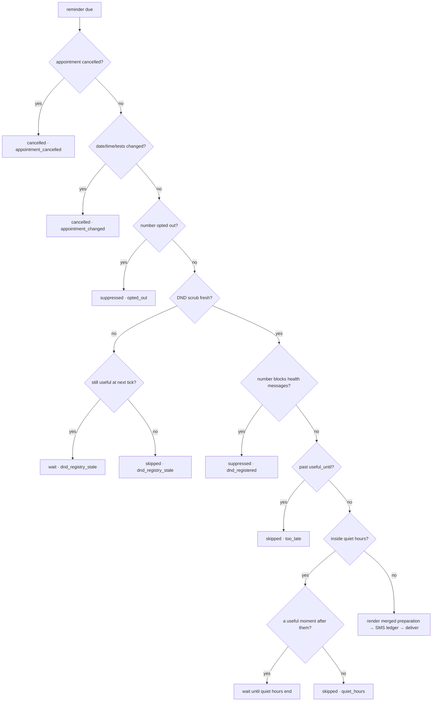

# A Reminder Tonight for Tomorrow's Fasting Test — Old vs New Code, Architecture, Line by Line

**Author:** Chakravardhan (team project — every new or changed block is marked `Author: Chakravardhan`)
**Story:** *As a patient with a fasting test tomorrow, I want a reminder tonight, so that my visit is not wasted.*
**Acceptance criteria:** Reminders are sent on a schedule per appointment type, carrying the merged preparation instruction. The do-not-disturb registry and quiet hours are honoured, and opt-out is permanent and immediate.
**Where it lives:** `clinic-api/` (the clinic data service), on top of the existing written-confirmation SMS system.
**Branch:** `dev_chakravardhan`. **Status:** implemented and tested **locally only — not committed, not pushed.**

---

## 0. What the story means

| Part | In plain words | What it forces in the code |
|---|---|---|
| "a fasting test tomorrow" | The patient must not eat for some hours before the test. | The system must know **which tests** an appointment has and **how long** each needs fasting. |
| "a reminder tonight" | A message the evening before, while the patient can still act on it. | A **scheduler** that sends at the right local time, and not after it stops being useful. |
| "so that my visit is not wasted" | A patient who ate breakfast has to come back another day. | For fasting, the reminder must arrive **before the fast begins** — or not at all. |
| "schedule per appointment type" | A doctor visit, a test, and a fasting test are reminded differently. | A **rule table** per type. |
| "merged preparation instruction" | Two tests on one morning = one instruction. | **Longest fasting time wins**, other instructions **once each**, one SMS. |
| "DND registry honoured" | Numbers on India's do-not-disturb registry are respected. | A **DND scrub** is loaded; blocked numbers are not messaged; a stale registry is not trusted. |
| "quiet hours honoured" | No messages at night. | Nothing sent inside **21:00–08:00** (configurable); move or skip. |
| "opt-out permanent" | "Stop" means stop, forever. | An opt-out list **nothing deletes**; new bookings and reseeds don't undo it. |
| "opt-out immediate" | Takes effect now, not at the next batch. | Pending reminders **suppressed in the same transaction**, including one already queued in the SMS ledger; re-checked at send. |

---

## 1. Summary — Old vs New

| | Old | New |
|---|---|---|
| Messages to patients | Booking, reschedule, cancellation SMS only | **plus** preparation reminders |
| Tests on an appointment | Not recorded | `appointment_tests` table, attached by counter/lab (`reminders.py order-tests`) |
| Preparation rules | None | `preparation.py`: fasting hours + instructions per test |
| Merged instruction | — | Longest fast → clock time ("20:00 থেকে শুধু জল খাবেন।"); other instructions once, fixed order |
| Schedule | — | consultation 18:00 day before · test 19:00 day before · fasting test 19:00 day before and ≥1 h before the fast |
| Quiet hours | — | 21:00–08:00 default (`CLINIC_QUIET_HOURS`); move earlier/later only while useful; else skip |
| DND registry | — | `dnd_registrations` + `dnd_scrubs`; health category / full block → suppressed; stale scrub → wait, then skip |
| Opt-out | — | `reminder_opt_outs`; immediate suppression; permanent; checked again at send |
| Delivery | SMS ledger (`NotificationAttempt`) | Reminders go through **the same ledger**, gateway, receipts, retries and staff failure queue |
| Records | — | `scheduled_reminders`: every reminder with status + reason (never silently dropped) |
| Running | — | Background loop in clinic-api when `CLINIC_REMINDERS_ENABLED=1`; staff command `reminders.py` |
| `/api/health` | notifications, history, schema | **plus** `reminders` block |
| HTTP API | — | **unchanged** (no new endpoint, no new field — contract snapshot untouched) |

---

## 2. Architecture

### 2.1 The pieces

```text
 ┌────────────── COUNTER / LAB (staff command: clinic-api/reminders.py) ──────────────┐
 │  order-tests KCD-…  "Blood Sugar Fasting" "Lipid Profile"   → appointment_tests     │
 │  opt-out 98xxxxxxxx                                          → reminder_opt_outs     │
 │  import-dnd scrub.txt                                        → dnd_registrations     │
 └───────────────────────────────────────────┬────────────────────────────────────────┘
                                             │
 ┌──── clinic-api process ───────────────────▼────────────────────────────────────────┐
 │                                                                                     │
 │  appointments (existing)         reminder_service.tick()  every 60 s  (NEW)         │
 │  appointment_tests (NEW)   ──►     1. plan()      → scheduled_reminders (NEW)       │
 │                                    2. send_due()  → checks → NotificationAttempt     │
 │                                                                                     │
 │  preparation.py (NEW)  ── merge(tests) → fasting time + instructions                │
 │  message_templates.py  ── reminder_visit / reminder_test templates + phrases (NEW)  │
 │                                                                                     │
 │  notify_service.deliver_now() (existing) ── notifications.send() ──► SMS gateway ──► patient
 │  receipts / retries / staff failure queue (existing, reused)                        │
 │  /api/health → "reminders": {...} (NEW)                                             │
 └─────────────────────────────────────────────────────────────────────────────────────┘
```

### 2.2 One fasting-test reminder, end to end

```mermaid
sequenceDiagram
    autonumber
    participant S as Counter staff
    participant R as reminder_service (loop)
    participant P as preparation.merge
    participant DB as clinic DB
    participant L as SMS ledger (notify_service)
    participant G as SMS gateway
    participant Pt as Patient

    S->>DB: order-tests KCD-… "Blood Sugar Fasting" "Lipid Profile"
    R->>DB: plan(): upcoming appointments + their tests
    R->>P: merge(tests, 08:00 tomorrow)
    P-->>R: fast 12 h → from 20:00; no alcohol
    R->>DB: ScheduledReminder(type=fasting_test, due 19:00, useful_until 20:00)
    Note over R: 19:00 tonight
    R->>DB: claim the reminder (only one tick can)
    R->>DB: appointment live & unchanged? opted out? DND fresh? DND blocked?
    R->>R: still useful? inside quiet hours?
    R->>L: NotificationAttempt (reminder_test, merged text)
    L->>G: send
    G->>Pt: "…08:00-এ পরীক্ষা। 20:00 থেকে শুধু জল খাবেন। আগের ২৪ ঘণ্টা মদ্যপান নয়। …"
```

### 2.3 The decision at send time



### 2.4 Schedule per appointment type

| Type | When the appointment is | Reminder at | Useful until |
|---|---|---|---|
| `consultation` | no tests attached | 18:00 the evening before | 2 h before the visit |
| `test` | tests, none need fasting | 19:00 the evening before | 2 h before the visit |
| `fasting_test` | any test needs fasting | 19:00 the evening before, **or 1 h before the fast if earlier** | when the fast begins |

| Example | Tests | Fast | Reminder | Useful until |
|---|---|---|---|---|
| 08:00 tomorrow | Blood Sugar Fasting + Lipid Profile | 12 h → 20:00 | **19:00 tonight** | 20:00 |
| 07:00 tomorrow | Lipid Profile | 12 h → 19:00 | **18:00 tonight** | 19:00 |
| 08:30 tomorrow | Blood Sugar Fasting | 10 h → 22:30 | 19:00 tonight | 22:30 |
| 09:00 tomorrow | Urine Routine | — | 19:00 tonight | 07:00 |
| 11:00 tomorrow | (doctor visit) | — | 18:00 tonight | 09:00 |

### 2.5 Quiet hours

| Situation | What happens |
|---|---|
| Due time outside quiet hours | Sent at the due time |
| Due time inside quiet hours, "just before they start" still ahead | Moved earlier that evening (e.g. 18:29 if quiet starts 18:30) |
| Booked late at night, still useful in the morning (doctor visit 11:00) | Waits until 08:00, sent then |
| Fasting test whose fast begins during quiet hours (USG at 10:00, fast from 04:00, booked 21:15) | **Skipped** — a message at 08:00 would arrive after the fast should have started |

### 2.6 Merged preparation

```text
 tests:  Blood Sugar Fasting (10 h)  +  Lipid Profile (12 h, no alcohol)  +  LFT (8 h)
                         │
                         ▼  preparation.merge()
          fasting_hours = max(10, 12, 8) = 12
          fast_from     = 08:00 − 12 h   = 20:00
          instructions  = {no_alcohol}   (once, fixed order)
                         │
                         ▼  MergedPreparation.test_variables()
          preparation      = "20:00 থেকে শুধু জল খাবেন।"
          preparation_more = "আগের ২৪ ঘণ্টা মদ্যপান নয়।"
```

- 1 instruction → second variable "ধন্যবাদ।"
- 2 instructions → both, whole
- 3 or more → the first, plus "বাকি নির্দেশ কাউন্টারে জানুন।" — **never a cut-off instruction**
- No preparation → "বিশেষ প্রস্তুতি লাগবে না।"

### 2.7 Opt-out: permanent and immediate

| Property | How it is guaranteed |
|---|---|
| Immediate | `opt_out()` suppresses every open reminder for the number **in the same transaction** |
| Immediate, even mid-send | A reminder already in the SMS ledger as `queued` is set to `skipped / opted_out`; `deliver_now()` only sends `queued` rows |
| Checked again at send | `_decide()` checks the opt-out list before every send |
| Permanent | No code deletes or updates `reminder_opt_outs` (tested by scanning clinic-api) |
| Permanent across bookings | New appointments for the same number are suppressed |
| Permanent across formats | Numbers stored as the last 10 digits: `+91-9000000201` = `9000000201` |
| Permanent across reseeds | `seed.py` imports `models` only, so `drop_all()` never sees the reminder tables (tested) |
| First record kept | Opting out twice keeps the original time and source |

### 2.8 DND registry

| Scrub preference for the number | Health reminder |
|---|---|
| `0` (fully blocked) | suppressed |
| blank | suppressed (treated as full block) |
| includes `4` (health) | suppressed |
| `1,2` (other categories only) | sent |
| not in the scrub | sent |
| **scrub older than 7 days / never loaded** | reminder **waits** for a fresh scrub while useful, then **skipped** |

A new scrub **replaces** the previous one (a number that left the registry stops being treated as registered).

---

## 3. What I found first

| Finding | Consequence |
|---|---|
| No reminder, DND, quiet-hours or opt-out code existed | All built new |
| The written-confirmation system already has DLT templates, a ledger, a gateway client, receipts, retries and a staff failure queue | Reminders reuse it: a reminder becomes an ordinary `NotificationAttempt` |
| Appointments are doctor visits; **no record of tests** | New `appointment_tests` table, attached by staff |
| Any new endpoint or request field changes the API contract snapshot (`scripts/gate-contracts/clinic-api.json`), a protected file needing code-owner review | **No HTTP change.** Staff actions via `reminders.py`; the scheduler runs in-process |
| Existing tests render every event in `ALL_EVENTS` with booking variables | Reminder events kept **out of** `ALL_EVENTS`, in `REMINDER_EVENTS` |
| `seed.py` does `drop_all()` | New tables live in `reminder_models.py`, which `seed.py` never imports, so opt-outs survive a reseed |
| Appointment times are local strings; the server may run in UTC | Reminder clock is clinic-local (`CLINIC_UTC_OFFSET_MINUTES=330`); ledger rows keep `notify_service`'s own clock |
| SQLAlchemy legacy `Column` typing causes mypy errors in existing files (baselined) | New tables use typed `Mapped[...]`; new code is mypy-clean |

---

## 4. Files

| File | Change | Lines |
|---|---|---|
| `clinic-api/reminder_models.py` | **NEW** — 5 tables | 160 |
| `clinic-api/preparation.py` | **NEW** — preparation rules + merge | 111 |
| `clinic-api/reminder_service.py` | **NEW** — schedule, quiet hours, DND, opt-out, plan, send, loop, health | 721 |
| `clinic-api/reminders.py` | **NEW** — staff command | 128 |
| `clinic-api/message_templates.py` | **ADDITIVE** — 2 reminder templates + preparation phrases | +~90 |
| `clinic-api/main.py` | **ADDITIVE** — import, start/stop loop, health block | +~20 |
| `tests/test_reminders.py` | **NEW** — 37 tests, 41 cases | 582 |
| `IMPLEMENTATION_PREPARATION_REMINDERS_OLD_VS_NEW.md` | **NEW** — this file | |

**Not changed:** `models.py`, `notify_service.py`, `notifications.py`, `seed.py`, `db.py`, every endpoint and request model, the voice agent, the API contract snapshot, gate config, all existing tests.

---

## 5. Variables

### 5.1 Environment (all new, all optional)

| Variable | Default | Meaning |
|---|---|---|
| `CLINIC_REMINDERS_ENABLED` | `0` | `1` starts the background loop in clinic-api |
| `CLINIC_REMINDER_TICK_S` | `60` | seconds between ticks (minimum 5) |
| `CLINIC_QUIET_HOURS` | `21:00-08:00` | no reminders inside; invalid value → default + error log |
| `CLINIC_UTC_OFFSET_MINUTES` | `330` | clinic local time (IST) |
| `CLINIC_DND_MAX_AGE_DAYS` | `7` | a scrub older than this is stale |
| `CLINIC_DND_REQUIRE_FRESH` | `1` | `0` sends without a fresh scrub (bench only) |
| `HOSPITAL_GATEWAY_TEMPLATE_REMINDER_VISIT` | empty | DLT template ID for `reminder_visit` |
| `HOSPITAL_GATEWAY_TEMPLATE_REMINDER_TEST` | empty | DLT template ID for `reminder_test` |

### 5.2 Constants — `reminder_service.py`

| Name | Values |
|---|---|
| Types | `consultation`, `test`, `fasting_test` |
| Statuses | `scheduled`, `sending`, `handed_off`, `suppressed`, `skipped`, `cancelled` |
| Reasons | `opted_out`, `dnd_registered`, `dnd_registry_stale`, `quiet_hours`, `too_late`, `appointment_cancelled`, `appointment_changed`, `template_render` |
| DND | `DND_FULL_BLOCK = "0"`, `DND_HEALTH_CATEGORY = "4"` |
| `SCHEDULES` | type → `Rule(name, days_before, at, hours_before=2, until_fast, lead_minutes=60)` |

### 5.3 New tables — `reminder_models.py`

| Table | Columns | Purpose |
|---|---|---|
| `appointment_tests` | confirmation_id, test_name, created_at; unique (confirmation_id, test_name) | tests on an appointment |
| `reminder_opt_outs` | phone (unique), source, opted_out_at | permanent opt-out |
| `dnd_registrations` | phone (unique), preference, imported_at | the latest DND scrub |
| `dnd_scrubs` | imported_at, numbers | proof the registry was checked, and when |
| `scheduled_reminders` | confirmation_id, phone, appointment_type, rule, plan_key, due_at, useful_until, status, reason, attempt_id, created_at, updated_at; unique (confirmation_id, rule, plan_key) | every reminder and its outcome |

### 5.4 New template events and phrases — `message_templates.py`

| Event | Variables |
|---|---|
| `reminder_visit` | patient_name, date, time_slot, doctor_name, preparation, confirmation_id |
| `reminder_test` | patient_name, date, time_slot, preparation, preparation_more, confirmation_id |

| Phrase code | Bengali (≤ 30 chars) |
|---|---|
| `fast_from` | `{time} থেকে শুধু জল খাবেন।` |
| `no_alcohol` | আগের ২৪ ঘণ্টা মদ্যপান নয়। |
| `first_urine` | সকালের প্রথম প্রস্রাব আনবেন। |
| `full_bladder` | ভরা মূত্রাশয়ে আসবেন। |
| `none` | বিশেষ প্রস্তুতি লাগবে না। |
| `more_at_counter` | বাকি নির্দেশ কাউন্টারে জানুন। |
| `bring_reports` | পুরনো রিপোর্ট সঙ্গে আনবেন। |
| `thanks` | ধন্যবাদ। |

---

## 6. Old vs New — modified files

### 6.1 `clinic-api/message_templates.py`

```python
# OLD
ALL_EVENTS = (EVENT_BOOKED, EVENT_RESCHEDULED, EVENT_CANCELLED)
```

```python
# NEW
ALL_EVENTS = (EVENT_BOOKED, EVENT_RESCHEDULED, EVENT_CANCELLED)

# PREPARATION REMINDERS -- Author: Chakravardhan.
# ... deliberately NOT in ALL_EVENTS ...
EVENT_REMINDER_VISIT = "reminder_visit"
EVENT_REMINDER_TEST = "reminder_test"

REMINDER_EVENTS = (EVENT_REMINDER_VISIT, EVENT_REMINDER_TEST)
```

| Line | Explanation |
|---|---|
| `ALL_EVENTS` unchanged | Existing tests render every `ALL_EVENTS` member with booking values; reminders need different variables. |
| `EVENT_REMINDER_*` | Stored on ledger rows (`NotificationAttempt.event`), so a stored data format. |
| `REMINDER_EVENTS` | What the reminder tests iterate. |

```python
# NEW — appended to _BODIES
    MessageTemplate(
        event=EVENT_REMINDER_VISIT,
        template_id=_template_id(EVENT_REMINDER_VISIT),
        category="transactional",
        body=(
            "{#var#}, রিমাইন্ডার: {#var#}, {#var#}-এ ডাঃ {#var#}। "
            "{#var#} রেফারেন্স {#var#}। "
            "আর না চাইলে ফোনে বা কাউন্টারে বলুন।"
        ),
        variables=("patient_name", "date", "time_slot", "doctor_name", "preparation", "confirmation_id"),
    ),
    MessageTemplate(
        event=EVENT_REMINDER_TEST,
        ...
        body=(
            "{#var#}, রিমাইন্ডার: {#var#}, {#var#}-এ পরীক্ষা। "
            "{#var#} {#var#} রেফারেন্স {#var#}। "
            "আর না চাইলে ফোনে বা কাউন্টারে বলুন।"
        ),
        variables=("patient_name", "date", "time_slot", "preparation", "preparation_more", "confirmation_id"),
    ),
```

| Line | Explanation |
|---|---|
| `_template_id(...)` | DLT ID from `HOSPITAL_GATEWAY_TEMPLATE_REMINDER_VISIT/_TEST`; empty = not registered → preflight refuses to send. |
| `category="transactional"` | Same registered category as the confirmations. |
| `"রিমাইন্ডার: … রেফারেন্স …"` | Names the appointment and carries the reference, like the confirmation SMS. |
| `"আর না চাইলে ফোনে বা কাউন্টারে বলুন।"` | "If you don't want these, tell us by phone or at the counter" — opt-out without a smartphone (the existing no-smartphone test walks these bodies). |
| Wording length | Worst case (30-char name + two 29-char instructions) = **3 SMS segments** (tested). |

```python
# NEW — after TEMPLATES
PREP_FAST_FROM = "fast_from"
... (codes)
PREP_PHRASES: dict[str, str] = { ... }

def prep_phrase(code: str, **values: str) -> str:
    phrase = PREP_PHRASES.get(code)
    if phrase is None:
        raise TemplateError(f"no preparation phrase {code!r}")
    return phrase.format(**values) if values else phrase
```

| Line | Explanation |
|---|---|
| `PREP_*` codes | `preparation.py` deals in codes; the **words** stay in the one file allowed to hold patient-facing SMS text. |
| `PREP_PHRASES` | Each ≤ `VAR_MAX_CHARS` (30) with the time filled in — tested. **Clinical review required.** |
| `prep_phrase()` | Unknown code → `TemplateError`, the same error type `render()` uses. |

### 6.2 `clinic-api/main.py`

```python
# OLD
import notify_service
import verification as verify
```

```python
# NEW
import notify_service
# PREPARATION REMINDERS -- Author: Chakravardhan. Imported before startup so
# its tables are registered on models.Base when create_all() runs.
import reminder_service
import verification as verify
```

| Line | Explanation |
|---|---|
| `import reminder_service` | Imports `reminder_models`, registering the 5 tables on `models.Base` so the existing `_ensure_seeded()` → `create_all()` creates them. No migration needed. |

```python
# NEW — after _ensure_seeded
@app.on_event("startup")
def _start_reminders():
    reminder_service.start_background()


@app.on_event("shutdown")
def _stop_reminders():
    reminder_service.stop_background()
```

| Line | Explanation |
|---|---|
| startup after `_ensure_seeded` | FastAPI runs startup handlers in registration order, so tables exist before the first tick. |
| `start_background()` | Returns immediately unless `CLINIC_REMINDERS_ENABLED=1` — existing deployments behave exactly as before. |
| `stop_background()` | Sets the stop event and joins the thread (5 s). |
| No routes | Event handlers are not part of the OpenAPI contract — `api-contract` passes unchanged. |

```python
# OLD (end of health())
        "schema_warning": _SCHEMA_WARNING,
    }
```

```python
# NEW
        "schema_warning": _SCHEMA_WARNING,
        # Preparation reminders -- Author: Chakravardhan. ...
        "reminders": reminder_service.summary(db),
    }
```

| Line | Explanation |
|---|---|
| `"reminders"` | enabled, running, last_tick_at, last_error, quiet_hours, opt_outs, dnd_registry_fresh, counts by status. A response key, not a request change — contract unchanged. |

---

## 7. New code — line by line

### 7.1 `clinic-api/reminder_models.py`

| Lines | Code | Explanation |
|---|---|---|
| 1–30 | docstring | Why a separate module (no `models.py` change; `seed.py` can't drop opt-outs); phone stored as last 10 digits. |
| 34–38 | `from sqlalchemy.orm import Mapped, mapped_column` / `from models import Base` | Same `Base` → same `create_all()`; typed columns → mypy-clean. |
| `AppointmentTest` | `confirmation_id`, `test_name`, `created_at`, unique pair | Tests on an appointment; denormalised name survives a catalogue reseed; unique pair makes attaching idempotent. |
| `ReminderOptOut` | `phone` unique, `source`, `opted_out_at` | Docstring states PERMANENT / IMMEDIATE and how each is enforced. |
| `DndRegistration` | `phone` unique, `preference`, `imported_at` | One number from the latest scrub; `preference` = blocked categories. |
| `DndScrub` | `imported_at`, `numbers` | Proves a scrub happened even when it found no numbers — what freshness is measured from. |
| `ScheduledReminder` | `due_at`, `useful_until`, `status`, `reason`, `attempt_id`, `plan_key`, unique (confirmation_id, rule, plan_key) | Every reminder and its outcome; `plan_key` detects reschedules and test changes; unique key prevents duplicates. |

### 7.2 `clinic-api/preparation.py`

| Lines | Code | Explanation |
|---|---|---|
| 1–30 | docstring | Why merge (two fasting times confuse patients); **clinical review required**. |
| `TestPreparation` | `fasting_hours`, `instructions` (codes) | One test's needs. |
| `PREPARATION` | Blood Sugar Fasting 10 h · Lipid Profile 12 h + no alcohol · LFT 8 h · USG Whole Abdomen 6 h · USG Pregnancy full bladder · Urine Routine first-morning urine | Keyed by `LabTest.name` as seeded. Unlisted test = no preparation. |
| `_INSTRUCTION_ORDER` | no_alcohol, full_bladder, first_urine | Fixed order regardless of ordering sequence. |
| `MergedPreparation.needs_fasting` | `fasting_hours > 0` | Decides `fasting_test` vs `test`. |
| `.phrases()` | fasting phrase first (time as `HH:MM`), then instruction phrases | Words from `message_templates`. |
| `.test_variables()` | 1 → (phrase, thanks) · 2 → both · 3+ → (first, more_at_counter) · 0 → (none, thanks) | Fits two 30-char DLT variables without ever truncating an instruction. |
| `merge(test_names, appointment_at)` | max fasting; union of codes; ordered; `fast_from = appointment − fasting_hours`; unknown tests listed | The merge. |

### 7.3 `clinic-api/reminder_service.py`

**Settings and clocks**

| Lines | Code | Explanation |
|---|---|---|
| 1–81 | docstring | Flow diagram, schedule table, quiet hours, DND, opt-out, clocks, running, no PHI in logs. |
| 114–138 | types, statuses, reasons, DND constants | Stored vocabulary. |
| 144–153 | `_env_int`, `_parse_hhmm` | Bad env values fall back to defaults. |
| 157–184 | `Settings.from_env()` | All tunables; invalid `CLINIC_QUIET_HOURS` logs an error and keeps 21:00–08:00; tick ≥ 5 s. |
| 187 | `local_now()` | UTC now + offset, naive — matches appointment strings regardless of server timezone. |
| 193 | `normalize_phone()` | Last 10 digits — one number however written. |

**Schedule**

| Lines | Code | Explanation |
|---|---|---|
| 203 | `Rule` | `days_before`, `at`, `hours_before`, `until_fast`, `lead_minutes`. |
| 215 | `SCHEDULES` | The per-type table (§2.4). |
| 223 | `Planned` | What a rule produces for one appointment. |
| 231–248 | `appointment_at`, `tests_for`, `classify`, `plan_key` | Appointment datetime; its tests; its type; its key (date+time+tests). |
| 250 | `plan_for()` | For each rule: due = day-before at `at`; fasting → `useful_until = fast_from`, due ≤ fast_from − 60 min; else `useful_until = visit − 2 h`. |

**Quiet hours**

| Lines | Code | Explanation |
|---|---|---|
| 272 | `in_quiet_hours()` | Handles windows crossing midnight; equal start/end = no quiet hours. |
| 281 | `outside_quiet_hours(due, useful_until, now)` | Not in quiet → due. In quiet → one minute before the window if still ahead and useful; else the window end if useful; else `None` (skip). |

**Opt-out**

| Lines | Code | Explanation |
|---|---|---|
| 309 | `is_opted_out()` | Lookup by normalised number. |
| 314 | `opt_out()` | Rejects non-10-digit numbers; inserts once (first record kept); suppresses open reminders; bulk-updates this number's still-`queued` reminder ledger rows to `skipped/opted_out`. Caller commits — the stop takes effect in that commit. |

**DND**

| Lines | Code | Explanation |
|---|---|---|
| 367 | `import_dnd()` | Normalises numbers; **flush**, then replace the whole registry; records a `DndScrub`. (The flush fixed a real bug found by a test: two scrubs in one transaction left the first behind.) |
| 388 | `dnd_registry_fresh()` | Latest scrub within `dnd_max_age_days`. |
| 393 | `dnd_blocks()` | Blank, `0`, `all` or `4` → blocked. |

**Tests on an appointment**

| Lines | Code | Explanation |
|---|---|---|
| 406 | `order_tests()` | Attaches new names only; next tick re-plans (type and instruction follow the tests). |

**Planning**

| Lines | Code | Explanation |
|---|---|---|
| 427 | `_finish()` | Status + reason + updated_at in one place. |
| 433 | `plan()` | For each upcoming live appointment: cancel open reminders whose `plan_key` no longer matches; insert missing ones; already too late → `skipped/too_late`; due inside quiet hours → moved earlier now, or `skipped/quiet_hours`. Then cancel open reminders of cancelled/missing appointments. Commits. |

**Sending**

| Lines | Code | Explanation |
|---|---|---|
| 499 | `_claim()` | `UPDATE … WHERE status='scheduled'` → only one tick wins (no double send — tested). |
| 510 | `_render()` | No tests → `reminder_visit` with "bring reports"; tests → `reminder_test` with merged variables. Patient/doctor names cleaned by the existing `notify_service._variables()`. |
| 522 | `_hand_to_ledger()` | Builds a `NotificationAttempt` exactly like a confirmation: same preflight (no gateway → `skipped`; unregistered template → `failed`). |
| 551 | `send_due()` | Claims each due reminder, decides, commits, then delivers queued ledger rows via `notify_service.deliver_now`. |
| 580 | `_decide()` | The ordered checks of §2.3. |
| 629 | `_wait_or_skip()` | Reschedule to `retry_at` if still before `useful_until`, else skip with the reason. |

**Loop and health**

| Lines | Code | Explanation |
|---|---|---|
| 644 | `tick()` | Own session: `plan` then `send_due`. |
| 660–681 | `_LoopState`, `_run()` | Thread loop; database/OS/value errors recorded in `last_error` (visible on health), next tick retries; stop event for shutdown. |
| 683 | `start_background()` | Only when enabled; idempotent. |
| 697 | `stop_background()` | Stop + join. |
| 704 | `summary()` | The health block. |

### 7.4 `clinic-api/reminders.py`

| Code | Explanation |
|---|---|
| docstring | Commands; why a command not an endpoint; opt-out has no undo; scrub file format; never prints full numbers. |
| `_say()` | `sys.stdout.write` (no `print`, per the gate's debug-code rule). |
| `_masked()` | `******0303` — last four digits only. |
| `_read_scrub()` | `phone[,categories]`, ignores blanks and `#`. |
| `opt-out` | Validates number, records, commits. |
| `order-tests` | Refuses an unknown appointment or a test not in the catalogue; attaches; commits. |
| `import-dnd` | Replaces the registry; commits. |
| `run-once` | One `tick()`. |
| `status` | The health summary. |

---

## 8. Tests — `tests/test_reminders.py` (37 tests, 41 cases)

| Group | Test | Proves |
|---|---|---|
| **Story** | `test_a_fasting_test_tomorrow_gets_one_reminder_tonight_before_the_fast` | 08:00 tests → due 19:00, useful until 20:00; nothing at 18:59; **one** SMS at 19:00 with merged fasting + no-alcohol |
| | `test_the_reminder_is_an_ordinary_ledger_row` | `NotificationAttempt` sent, event, phone, body |
| | `test_two_ticks_at_the_same_moment_send_once` | no double send |
| **Schedule per type** | `test_each_appointment_type_follows_its_own_schedule` | consultation 18:00, test 19:00, fasting 19:00 / until fast |
| | `test_an_early_fast_moves_the_reminder_earlier` | 07:00 + 12 h → 18:00 |
| | `test_a_consultation_reminder_carries_the_visit_template` | visit template + bring reports |
| | `test_a_booking_made_after_the_fast_began_is_not_reminded` | skipped / too_late |
| | `test_a_booking_made_after_the_usual_time_is_reminded_at_once_if_still_useful` | sent immediately |
| **Merged preparation** | `test_the_longest_fast_wins_and_instructions_appear_once` | 12 h, 20:00, no_alcohol once |
| | `test_instructions_from_different_tests_are_merged_in_a_fixed_order` | order; 3+ → "more at counter" |
| | `test_tests_that_need_nothing_say_so` | none + thanks |
| | `test_every_preparation_phrase_fits_one_dlt_variable` | ≤ 30 chars |
| | `test_a_worst_case_reminder_stays_within_three_segments` ×2 | ≤ 3 segments, transactional, markers = variables |
| | `test_reminder_events_are_not_booking_events` | kept out of `ALL_EVENTS` |
| **Quiet hours** | `test_quiet_hours_cross_midnight` | 21:00 / 02:00 / 07:59 quiet; 08:00 / 20:59 not |
| | `test_nothing_is_sent_inside_quiet_hours_and_a_useful_reminder_waits_for_morning` | booked 21:30 → sent 08:00 |
| | `test_a_fasting_reminder_is_skipped_rather_than_sent_the_morning_of` | skipped / quiet_hours |
| | `test_a_due_time_inside_quiet_hours_is_moved_earlier_the_same_evening` | 18:29 |
| | `test_quiet_hours_come_from_the_environment` | env + bad value fallback |
| **DND** | `test_the_dnd_registry_is_honoured_for_health_messages` ×4 | `0`, `1,4`, blank blocked; `1,2` sent |
| | `test_a_number_registered_after_planning_is_still_not_messaged` | checked at send |
| | `test_a_stale_registry_is_not_honoured_so_reminders_wait_then_skip` | waits; fresh scrub → sent |
| | `test_a_registry_that_never_arrives_skips_the_reminder_at_its_deadline` | skipped / dnd_registry_stale |
| | `test_a_scrub_replaces_the_previous_one` | snapshot semantics |
| **Opt-out** | `test_opting_out_stops_a_planned_reminder_at_once` | suppressed before any tick |
| | `test_opting_out_stops_a_reminder_already_in_the_sms_ledger` | queued ledger row → skipped; `deliver_now` sends nothing |
| | `test_an_opt_out_is_permanent_across_new_bookings_and_number_formats` | `+91-` form, later booking suppressed |
| | `test_opting_out_twice_keeps_the_first_record` | first time/source kept |
| | `test_an_opt_out_needs_a_real_number` | ValueError |
| | `test_nothing_in_clinic_api_can_undo_an_opt_out` | no delete/update in clinic-api; seed.py doesn't import reminder tables |
| | `test_the_counter_command_records_an_opt_out_without_echoing_the_number` | CLI works; full number not printed |
| **Appointment changes** | `test_a_cancelled_appointment_cancels_its_reminder` | cancelled, no SMS |
| | `test_a_rescheduled_appointment_gets_a_new_reminder_and_the_old_one_is_cancelled` | old cancelled, new planned, nothing sent for old date |
| | `test_tests_ordered_later_change_the_type_and_the_instruction` | consultation → fasting_test |
| **Running** | `test_a_bench_pod_with_no_gateway_records_the_reminder_and_sends_nothing` | handed_off + ledger skipped |
| | `test_the_loop_is_off_unless_switched_on` | disabled by default |
| | `test_health_reports_reminders` | health block shape |

---

## 9. Results (local)

| Check | Result |
|---|---|
| `python -m pytest tests/test_reminders.py` | **41 passed** |
| `python -m pytest tests` | **793 passed, 2 failed** — the 2 are the pre-existing golden-set entry `fp-abstain-unknown-doctor` |
| `bash scripts/gate.sh --full` | **PASS:** compile, lint, **typecheck** (after fixing 4 new mypy errors with typed columns), dead-code, bandit, secrets, credentials, dependencies, build, **api-contract (unchanged)**, debug-code, unexpected-files, **PHI in code**, **PHI in logs**, approved test data, **gate-protection**, integration, safety-policy, phi-boundary, multilingual, handoff, 8 kHz, telephony |
| Still red, not caused by this story | `format` (same 42 pre-existing files; new files formatted), golden-set / escalation-abstention / unit-tests (golden entry) |
| Suppressions added | **0** |
| Staff command smoke test on a scratch DB | import-dnd, opt-out (masked output), order-tests (rejects unknown test and unknown appointment), run-once, status |

---

## 10. How to run

```bash
python -m pytest tests/test_reminders.py -v
```

```bash
export CLINIC_REMINDERS_ENABLED=1
```

```bash
export HOSPITAL_GATEWAY_TEMPLATE_REMINDER_TEST=<DLT content id>
```

```bash
export HOSPITAL_GATEWAY_TEMPLATE_REMINDER_VISIT=<DLT content id>
```

```bash
cd clinic-api && python reminders.py import-dnd /secure/path/ncpr_scrub.txt
```

```bash
cd clinic-api && python reminders.py order-tests KCD-20260915-AB12 "Blood Sugar Fasting" "Lipid Profile"
```

```bash
cd clinic-api && python reminders.py opt-out 9876543210 --source counter
```

```bash
cd clinic-api && python reminders.py status
```

---

## 11. Honest limits and next steps

| Limit | Why | Next step |
|---|---|---|
| **Tests are attached by staff, not at booking.** | The booking API has no tests field; adding one changes the API contract (code-owner review). | Add an optional `tests` field to booking (or a lab-order endpoint) with a contract snapshot update approved by a code owner. |
| **Patients opt out via counter/phone staff, not by themselves in the voice bot or by SMS reply.** | Both need a new endpoint (and a voice-bot intent) — API contract change. | Opt-out endpoint + voice intent ("রিমাইন্ডার বন্ধ করুন") + SMS "STOP" webhook, calling the existing `opt_out()`. |
| **Preparation rules and wording need clinical review.** | They are the lab's policy. | Lab sign-off on `PREPARATION` and `PREP_PHRASES`. |
| **Reminder templates need DLT registration.** | Unregistered → preflight marks the ledger row failed. | Register both bodies verbatim; set the two env IDs. |
| **DND category mapping (`4` = health) to be confirmed** against the scrub vendor's format. | Formats vary by provider. | Confirm with the telecom scrub provider; adjust `dnd_blocks()`. |
| Stale DND scrub blocks all reminders by default. | Can't honour a registry that wasn't checked. | Schedule a daily scrub import; `CLINIC_DND_REQUIRE_FRESH=0` only on a bench. |
| One loop per clinic-api process. | Claims prevent double sends, but multiple workers all tick. | Run reminders in one worker, or keep claims (already safe). |
| A reseed via `python seed.py` inside a process that imported `reminder_models` would drop its tables. | Shared `Base`. | Only run `seed.py` standalone (as documented); consider a separate metadata. |
| Hindi/English reminder text not built. | Existing SMS templates are Bengali only. | Add per-language templates when registered. |
